# The Agentic Web

**AI agents should work for you, not for platforms.** The Agentic Web puts intelligent agents in service of users, not corporations.

## The Challenge

AI is transforming how we interact with the web. But there's a risk: if AI agents work for platforms, they'll optimize for platform goals (engagement, ads, data collection), not user goals.

```mermaid
flowchart TB
    subgraph platform["❌ Platform AI"]
        PG["🏢 Platform Goals"]
        PA["🤖 AI Agent"]
        PU["👤 User<br/><small>(product)</small>"]
        PG --> PA --> PU
    end
    style platform fill:#fee2e2,stroke:#dc2626
```

```mermaid
flowchart TB
    subgraph user["✅ User AI"]
        UG["👤 User Goals"]
        UA["🤖 AI Agent"]
        US["✨ User<br/><small>(served)</small>"]
        UG --> UA --> US
    end
    style user fill:#dcfce7,stroke:#16a34a
```

| Platform AI | User AI |
|-------------|---------|
| Agent works FOR platform | Agent works FOR user |
| User is the product | User is the principal |

We need agents that:

| Requirement | Description |
|-------------|-------------|
| **Serve the user first** | Your goals, your priorities |
| **Access your data** | With your permission, from your pods |
| **Act on your behalf** | Automate tasks, make decisions |
| **Are transparent** | You can see what they do and why |
| **Are trustworthy** | Provably safe behavior over time |
| **Are portable** | Take them with you, not locked to platforms |

## SAND Enables the Agentic Web

The SAND stack provides the foundation:

```mermaid
flowchart TB
    Agent["🤖 AI Agent<br/><small>serves the user</small>"]
    Agent --> Solid["📦 Solid<br/><small>Read/write pod</small>"]
    Agent --> DID["🔑 DID<br/><small>Verify identity</small>"]
    Agent --> Comms["🌐 Nostr/AP<br/><small>Federate comms</small>"]
    Agent --> Trust["⛓️ BlockTrails<br/><small>Audit trail</small>"]

    style Agent fill:#f3e8ff,stroke:#9333ea
    style Solid fill:#dcfce7,stroke:#16a34a
    style DID fill:#dbeafe,stroke:#2563eb
    style Comms fill:#fef3c7,stroke:#d97706
    style Trust fill:#f1f5f9,stroke:#64748b
```

### Data Access (Solid)
Agents can read from and write to your pod — with your permission. Your data stays yours.

### Identity (DID)
Agents can verify who you are and act on your behalf using your decentralized identity.

### Communication (Nostr/ActivityPub)
Agents can communicate across the network, federate with other agents, and coordinate actions.

### Trust (BlockTrails)
Agent behavior can be anchored to Bitcoin for provable audit trails — trust through time.

## The Nine Principles

The [Manifesto](/manifesto) defines nine principles for the Agentic Web:

| # | Principle | Meaning |
|---|-----------|---------|
| 1 | **Agents Must Serve the User First** | Your agent, your goals |
| 2 | **Identity and Intent Must Be Verifiable** | Know who/what you're dealing with |
| 3 | **Data Sovereignty Is Non-Negotiable** | Your data, your rules |
| 4 | **Open Protocols, Not Walled Gardens** | Interoperability required |
| 5 | **Local-First, Cloud-Optional** | Work offline, sync when ready |
| 6 | **Transparent Logic, Tunable Behavior** | See what it does, adjust how |
| 7 | **Sustainable Ecosystems Over Extraction** | Value creation, not extraction |
| 8 | **Community-Driven Standards** | Open governance |
| 9 | **Safety and Trust Through Time** | Prove trustworthiness |

## Agent Architecture

How an agentic system works:

```mermaid
flowchart TB
    User["👤 User<br/><small>'Book me a dentist appointment'</small>"]

    subgraph Core["🤖 Agent Core"]
        Intent["Intent Parser"] --> Planning["Planning Engine"] --> Exec["Execution Engine"]
    end

    User --> Core

    Core --> Pod["📦 Pod Access<br/><small>Solid</small>"]
    Core --> Calendar["📅 Calendar API<br/><small>MCP</small>"]
    Core --> External["🌐 External Services<br/><small>MCP</small>"]

    Pod --> Audit["⛓️ BlockTrail<br/><small>audit log</small>"]
    Calendar --> Audit
    External --> Audit

    style User fill:#fef3c7,stroke:#d97706
    style Core fill:#f3e8ff,stroke:#9333ea
    style Audit fill:#f1f5f9,stroke:#64748b
```

Every action logged • User can review • Trust builds over time

## Practical Examples

### Personal AI Assistant

An agent that:

| Step | Action | SAND Component |
|------|--------|----------------|
| 1 | Reads your calendar from your pod | Solid |
| 2 | Checks your preferences | Solid |
| 3 | Authenticates as you | DID |
| 4 | Books appointments that fit your schedule | MCP |
| 5 | Reports what it did | Transparent logging |
| 6 | Logs action to blockchain | BlockTrails |

### Social Feed Curator

An agent that:

| Step | Action | SAND Component |
|------|--------|----------------|
| 1 | Reads posts from your follows | ActivityPub/Nostr |
| 2 | Filters based on YOUR criteria | Local algorithm |
| 3 | Highlights what you want to see | Not engagement-driven |
| 4 | Learns from your feedback | Private learning |

### Data Steward

An agent that:

| Step | Action | SAND Component |
|------|--------|----------------|
| 1 | Monitors access to your pod | Solid ACL |
| 2 | Alerts you to unusual requests | Pattern detection |
| 3 | Suggests permission changes | Privacy analysis |
| 4 | Maintains audit log | BlockTrails |

### Multi-Agent Collaboration

Agents can work together:

```mermaid
sequenceDiagram
    participant AA as 🤖 Alice's Agent
    participant AP as 📦 Alice's Pod
    participant BB as 🤖 Bob's Agent
    participant BP as 📦 Bob's Pod

    AA->>AP: Check Alice's calendar
    AA->>BB: Nostr DM: Schedule meeting?
    BB->>BP: Check Bob's availability
    BB->>AA: Response: Available Tuesday
    AA->>AP: Create calendar event
    BB->>BP: Create calendar event
    Note over AA,BB: Meeting scheduled without human coordination
```

## Key Technologies

### Model Context Protocol (MCP)

[MCP](/projects/mcp) connects AI models to external tools and data. It's how agents access your Solid pod, query data, and take actions.

| Capability | Description |
|------------|-------------|
| Tools | Call external APIs |
| Resources | Access structured data |
| Prompts | Reusable instruction templates |
| Sampling | Let servers request LLM completions |

### BlockTrails

[BlockTrails](/projects/blocktrails) anchors agent behavior to Bitcoin. Over time, an agent builds a verifiable history of safe behavior.

| Feature | Benefit |
|---------|---------|
| Immutable log | Actions can't be hidden |
| Time-stamped | When things happened |
| Verifiable | Anyone can audit |
| Trust accumulation | Reputation builds |

### Web Prompts

[Web Prompts](/projects/web-prompts) standardizes how you instruct agents. Shareable, versionable prompt templates.

### AAM (Agent-to-Agent Manager)

[AAM](/projects/aam) enables agents to discover each other, share capabilities, and collaborate.

## Permission Model

Agents need explicit permission:

:::info Example: CalendarBot Permission Request

| Permission | Requested | Granted |
|------------|-----------|---------|
| Read calendar events | ✅ | ✅ |
| Write new events | ✅ | ✅ |
| Delete events | ✅ | ❌ |
| Access contacts (read-only) | ✅ | ✅ |

**Duration:** 30 days | **Actions:** Approve, Deny, Customize

:::

**Key principles:**
- Granular control over what agents can do
- Time-limited permissions
- Revocable at any time
- Logged for audit

## Trust Spectrum

Not all agents deserve the same trust:

| Trust Level | Permissions | Verification | Example |
|-------------|-------------|--------------|---------|
| **None** | Read public only | Anonymous | New bot |
| **Low** | Read private (limited) | DID verified | Known developer |
| **Medium** | Read/write (scoped) | Track record | Established agent |
| **High** | Full automation | Long history | Trusted personal agent |

## The Vision

Imagine:

- An agent that manages your digital life — across all your data, all your services
- That you can trust because its behavior is auditable
- That you can take with you — it's not locked to any platform
- That works with other people's agents seamlessly
- That gets better at serving you over time

This is the Agentic Web. SAND makes it possible.

## Challenges and Solutions

| Challenge | Solution |
|-----------|----------|
| Agent alignment | User-defined goals, transparent logic |
| Runaway actions | Permission limits, human-in-the-loop |
| Privacy leaks | Local-first processing, minimal data sharing |
| Bad actors | BlockTrails reputation, community reporting |
| Complexity | Progressive disclosure, good defaults |

## Learn More

- [Manifesto](/manifesto) — The full philosophical framework
- [BlockTrails](/projects/blocktrails) — Trust through time
- [MCP](/projects/mcp) — Model Context Protocol
- [AAM](/projects/aam) — Agent-to-Agent Manager
- [Agentic Alliance](/projects/agentic-alliance) — Coalition for ethical agents
