# SAND Architecture

**How Solid, ActivityPub, Nostr, and DID work together.** A visual guide to the stack.

## The Full Picture

```mermaid
flowchart TB
    subgraph apps["Applications"]
        SolidOS["SolidOS"]
        Ditto["Ditto"]
        Damus["Damus"]
        Mastodon["Mastodon"]
        YourApp["Your App"]
    end

    subgraph protocols["Protocols"]
        Solid["📦 Solid<br/><small>LDP</small>"]
        NostrR["⚡ Nostr<br/><small>relay</small>"]
        NostrC["⚡ Nostr<br/><small>client</small>"]
        AP["🌐 ActivityPub<br/><small>S2S</small>"]
    end

    subgraph identity["Identity Layer"]
        DID["🔑 DID<br/><small>did:web, did:nostr, did:key</small>"]
    end

    SolidOS --> Solid
    Ditto --> NostrR
    Damus --> NostrC
    Mastodon --> AP
    YourApp --> Solid

    Solid --> DID
    NostrR --> DID
    NostrC --> DID
    AP --> DID

    style apps fill:#f3e8ff,stroke:#9333ea
    style protocols fill:#dbeafe,stroke:#2563eb
    style identity fill:#dcfce7,stroke:#16a34a
```

## Protocol Roles

Each protocol has a distinct role in the stack:

| Protocol | Role | Strength |
|----------|------|----------|
| **Solid** | Data storage & access control | Structured data, permissions |
| **ActivityPub** | Federation & social | Server-to-server communication |
| **Nostr** | Real-time & censorship-resistance | Simplicity, resilience |
| **DID** | Identity | Portable, self-sovereign |

## Data Flow: Reading a Profile

## Data Flow: Social Posting

```mermaid
flowchart TB
    Post["📝 User Posts"]

    Post --> Solid["📦 Solid Pod"]
    Post --> Nostr["⚡ Nostr Relays"]
    Post --> AP["🌐 ActivityPub"]

    Solid -->|"store"| Archive["🗄️ Private Archive"]
    Nostr -->|"broadcast"| AllRelays["📡 All Relays"]
    AP -->|"federate"| Followers["👥 Followers' Servers"]

    style Post fill:#fef3c7,stroke:#d97706
```

A single post can:
1. **Store** in your Solid pod (your archive)
2. **Broadcast** to Nostr relays (public, censorship-resistant)
3. **Federate** via ActivityPub (reach Mastodon users)

## Authentication Flow

### Solid-OIDC

```mermaid
sequenceDiagram
    participant User as 👤 User
    participant App as 📱 App
    participant IdP as 🔐 Identity Provider

    User->>App: 1. "Login with Solid"
    App->>User: 2. Redirect to IdP
    User->>IdP: 3. Authenticate
    IdP->>App: 4. Redirect with token
    App->>User: 5. Access granted
```

### Nostr (NIP-98)

```mermaid
sequenceDiagram
    participant User as 👤 User
    participant Server as 🖥️ Server

    User->>Server: 1. Sign event with nsec
    Note over Server: Authorization: Nostr <event>
    Server->>Server: 2. Verify signature
    Server->>User: 3. Access granted ✅
```

## Server Architecture: Sandymount

```mermaid
flowchart TB
    subgraph sandymount["🏖️ Sandymount"]
        subgraph protocols["Protocol Handlers"]
            LDP["📦 Solid LDP<br/><small>storage</small>"]
            Relay["⚡ Nostr Relay<br/><small>real-time</small>"]
            Git["🔀 Git HTTP<br/><small>version</small>"]
        end

        JSS["⚙️ JSS Core<br/><small>JavaScript Solid Server</small>"]

        FS["💾 File System<br/><small>./data/</small>"]

        LDP --> JSS
        Relay --> JSS
        Git --> JSS
        JSS --> FS
    end

    style sandymount fill:#dbeafe,stroke:#2563eb
    style FS fill:#f1f5f9,stroke:#64748b
```

## Client Architecture: Typical Solid App

```mermaid
flowchart TB
    subgraph browser["📱 Browser / App"]
        UI["🎨 Your UI<br/><small>React, Vue, vanilla JS</small>"]
        Client["@inrupt/solid-client<br/><small>high-level operations</small>"]
        Auth["@inrupt/solid-client-authn<br/><small>Solid-OIDC auth</small>"]
        RDF["rdflib.js<br/><small>low-level RDF</small>"]

        UI --> Client --> Auth --> RDF
    end

    RDF -->|"HTTPS"| Pod["📦 Solid Pod"]

    style browser fill:#f3e8ff,stroke:#9333ea
    style Pod fill:#dcfce7,stroke:#16a34a
```

## Multi-Protocol Agent Architecture

```mermaid
flowchart TB
    subgraph agent["🤖 AI Agent"]
        LLM["🧠 LLM Core<br/><small>Claude, GPT, etc.</small>"]
        MCP["⚙️ MCP Client<br/><small>Model Context Protocol</small>"]

        LLM --> MCP

        MCP --> SolidMCP["MCP Server<br/><small>Solid</small>"]
        MCP --> NostrMCP["MCP Server<br/><small>Nostr</small>"]
        MCP --> APMCP["MCP Server<br/><small>ActivityPub</small>"]
    end

    SolidMCP --> Pod["📦 Pod"]
    NostrMCP --> Relays["⚡ Relays"]
    APMCP --> Servers["🌐 Servers"]

    style agent fill:#f3e8ff,stroke:#9333ea
```

## See Also

- [Protocols Overview](/protocols/overview) — Individual protocol details
- [Concepts Overview](/concepts/overview) — Foundational ideas
- [Sandymount](/projects/sandymount) — Run the full stack
