# Data Sovereignty

**Your data belongs to you.** This simple idea has radical implications for how we build the web.

## The Problem

Today, your data is scattered across hundreds of services:

```mermaid
flowchart LR
    subgraph problem["❌ Your Data Today"]
        You((You))
        You --> IG["📷 Instagram<br/><small>they own your photos</small>"]
        You --> GD["📄 Google Drive<br/><small>they own your docs</small>"]
        You --> WA["💬 WhatsApp<br/><small>they own your messages</small>"]
        You --> LI["💼 LinkedIn<br/><small>they own your network</small>"]
        You --> SP["🎵 Spotify<br/><small>they own your playlists</small>"]
    end

    style problem fill:#fee2e2,stroke:#dc2626
    style You fill:#fef3c7,stroke:#d97706
```



**Problems:**
- Each service has different terms you didn't read
- Each can change rules, lock you out, or shut down
- Data used to train AI, serve ads, profile you
- Switching means losing everything

You're a tenant in someone else's building.

## The Solution

Data sovereignty inverts this model:

```mermaid
flowchart TB
    subgraph solution["✅ Your Data Tomorrow"]
        Pod["📦 Your Pod"]
        Photos["📷 photos/"]
        Docs["📄 documents/"]
        Messages["💬 messages/"]
        Social["👥 social/"]

        Pod --> Photos
        Pod --> Docs
        Pod --> Messages
        Pod --> Social

        Photos --> PhotoApp["Photo App<br/><small>read access</small>"]
        Docs --> DocEditor["Doc Editor<br/><small>read/write</small>"]
        Messages --> Agent["🤖 AI Agent<br/><small>with permission</small>"]
        Social --> Agent
    end

    style solution fill:#dcfce7,stroke:#16a34a
    style Pod fill:#dbeafe,stroke:#2563eb
    style Agent fill:#f3e8ff,stroke:#9333ea
```



### Core Principles

| Principle | What It Means |
|-----------|---------------|
| **You choose where data lives** | Your server, trusted provider, local device |
| **Apps come to your data** | Instead of giving data to apps |
| **You control access** | Grant, revoke, audit permissions |
| **You can leave** | Export everything, switch providers |
| **Data is interoperable** | Same data works across apps |

## Why It Matters

### Privacy

Your data isn't harvested to:
- Train AI models you don't consent to
- Build advertising profiles
- Be sold to data brokers
- Be leaked in breaches you didn't cause

### Control

You decide:
- Who sees what
- How long they have access
- What they can do with it
- When to revoke access

### Portability

No lock-in:
- Switch photo apps without losing photos
- Change social networks without losing connections
- Move providers without starting over

### Longevity

Your data survives:
- Services shutting down
- Companies being acquired
- Policy changes
- Account suspensions

## How SAND Implements This

### Solid Pods

[Solid](/protocols/solid) provides the primary mechanism for data sovereignty. A Solid pod is a personal web server where your data lives:

```
your-pod.example.com/
├── profile/
│   └── card           # Your identity (WebID)
├── photos/
│   ├── 2024/
│   └── 2023/
├── documents/
│   └── notes/
├── social/
│   ├── contacts
│   └── messages
└── settings/
    └── prefs.ttl
```

Apps don't store your data — they read from and write to your pod with your permission.

### Nostr Events

[Nostr](/protocols/nostr) stores messages and events cryptographically signed with your key. Even though events are distributed across relays:

- They're provably yours (only you have the private key)
- Multiple relays provide redundancy
- No single point of failure
- You can move between clients freely

### DIDs

[Decentralized Identifiers](/protocols/did) ensure your identity isn't tied to any provider:

- Your DID works everywhere
- You control the keys
- No platform can take your identity
- Portable across the entire web

## Comparison

| Aspect | Centralized | Sovereign |
|--------|-------------|-----------|
| **Data location** | Service's servers | Your choice |
| **Terms of service** | Their rules | Your rules |
| **Service shutdown** | Data lost | Data persists |
| **App switching** | Start over | Data stays |
| **AI training** | Your data used | You decide |
| **Privacy** | Trust them | Trust yourself |
| **Portability** | Maybe export | Full ownership |

## Real-World Examples

### Photos

**Today:** Upload to Instagram → Instagram owns the relationship with your data, can delete, ban, change terms.

**Sovereign:** Store in your pod → Use any photo app that can read from your pod. Switch apps without losing photos. Your AI can organize them.

### Documents

**Today:** Write in Google Docs → Google can read everything, train AI on your content, change pricing.

**Sovereign:** Write to your pod → Use any editor. Documents survive any single service. Full export always available.

### Social Graph

**Today:** Build network on LinkedIn → LinkedIn owns your connections. Leave = lose everything.

**Sovereign:** Contacts in your pod → Take your network anywhere. Any social app can read (with permission).

## Challenges

### Convenience

Sovereign systems require more setup than signing up for a free service. This is improving:
- Hosted pod providers
- Better tooling
- Simpler apps

### Network Effects

Value often comes from others using the same platform. Federation and bridges help:
- Nostr clients are interoperable
- ActivityPub connects Fediverse
- Bridges connect protocols

### Technical Complexity

Running your own infrastructure requires knowledge. Solutions:
- Managed providers
- One-click deployments
- Local-first apps

## Getting Started

1. **Set up a pod** — Use [Sandymount](/projects/sandymount) to run your own, or choose a provider
2. **Create a Nostr identity** — Generate keys with [Noskey](/projects/noskey) or any client
3. **Use sovereign apps** — Applications that work with your data
4. **Control access** — Learn to manage permissions

See [Your First Pod](/guides/your-first-pod) for a hands-on tutorial.

## Learn More

- [Solid Protocol](/protocols/solid) — The technical specification
- [Nostr Protocol](/protocols/nostr) — Cryptographic messaging
- [Linked Data](/concepts/linked-data) — How data connects
- [Local-First](/concepts/local-first) — Offline-capable sovereignty
- [Manifesto](/manifesto) — The philosophy behind it all
