# Decentralized Identity

**Your identity shouldn't depend on any company.** Decentralized identity lets you prove who you are without a middleman.

## The Problem with Centralized Identity

Today, your online identity is fragmented and dependent:

```mermaid
flowchart BT
    subgraph problem["❌ Fragmented Identity"]
        Alice((Alice))
        T["Twitter<br/><small>@alice</small>"]
        G["Google<br/><small>alice@gmail</small>"]
        F["Facebook<br/><small>alice.fb</small>"]
        B["Bank<br/><small>acct#123</small>"]
        T --> Alice
        G --> Alice
        F --> Alice
        B --> Alice
    end
    style problem fill:#fee2e2,stroke:#dc2626
    style Alice fill:#fef3c7,stroke:#d97706
```



**Problems:**
- Different identity on each service
- Platforms can terminate accounts
- No way to prove these are the same person
- Reputation and history locked in silos

| Problem | Impact |
|---------|--------|
| **Platform accounts** | You're `@alice` on Twitter, `alice@gmail.com` on Google |
| **OAuth dependency** | "Sign in with Google" means Google controls your access |
| **Account termination** | Platforms can delete your account |
| **No portability** | Can't take followers, reputation, or history |
| **Surveillance** | Platforms track everything |

## Decentralized Identifiers (DIDs)

A DID is an identifier that:

| Property | Description |
|----------|-------------|
| **You control** | No registration authority needed |
| **Globally unique** | Works across all systems |
| **Cryptographically verifiable** | Prove you own it with a signature |
| **Portable** | Take it anywhere |
| **Persistent** | Doesn't expire or get revoked |

### DID Syntax


**Examples:**
- `did:nostr:npub1qqqqqqqqqqqqqqqqqqqqqqqqqqqqqqqqqqqqqkxl8lt`
- `did:web:alice.example.com`
- `did:key:z6MkhaXgBZDvotDkL5257faiztiGiC2QtKLGpbnnEGta2doK`

## How DIDs Work

```mermaid
flowchart TB
    DID["🔑 did:nostr:npub1abc123..."]
    DID -->|"resolve"| Doc["📄 DID Document"]
    Doc -->|"extract"| Key["🔐 Public Key"]
    Key -->|"verify"| Sig["✅ Signatures"]

    style DID fill:#dbeafe,stroke:#2563eb
    style Doc fill:#fef3c7,stroke:#d97706
    style Key fill:#f3e8ff,stroke:#9333ea
    style Sig fill:#dcfce7,stroke:#16a34a
```



**DID Document contains:**

```json
{
  "@context": "https://www.w3.org/ns/did/v1",
  "id": "did:nostr:npub1abc123...",
  "verificationMethod": [{
    "type": "SchnorrSecp256k1",
    "publicKeyHex": "abc123..."
  }],
  "authentication": ["#key-0"],
  "service": [{
    "type": "SolidStorage",
    "serviceEndpoint": "https://pod.example/"
  }]
}
```

The DID Document contains:

| Field | Purpose |
|-------|---------|
| `verificationMethod` | Public keys for authentication |
| `authentication` | Which keys can authenticate |
| `service` | Endpoints (pod, social profiles, etc.) |
| `assertionMethod` | Keys for signing credentials |
| `keyAgreement` | Keys for encryption |

## DID Methods in SAND

### Comparison

| Method | Resolution | Infrastructure | Use Case |
|--------|------------|----------------|----------|
| **did:nostr** | Derive from key | None | Personal identity |
| **did:web** | HTTPS fetch | Domain | Organizations |
| **did:key** | Derive from key | None | Ephemeral |

### did:nostr

Uses Nostr keypairs as identifiers. Simple, no infrastructure needed:

```
did:nostr:npub1qqqqqqqqqqqqqqqqqqqqqqqqqqqqqqqqqqqqqqqqqqqqqqqqqkxl8lt
```

| Aspect | Detail |
|--------|--------|
| Resolution | Decode npub to get public key |
| Signing | secp256k1 Schnorr signatures |
| Infrastructure | None required |
| Portability | Perfect—key is the identity |

Your Nostr keypair *is* your identity. See [did:nostr](/projects/did-nostr) for details.

### did:web

Uses your domain as your identifier:

```
did:web:alice.example.com
```

Resolution:
```
GET https://alice.example.com/.well-known/did.json
```

| Aspect | Detail |
|--------|--------|
| Resolution | HTTPS fetch |
| Trust | Domain ownership |
| Infrastructure | Web server |
| Use case | Organizations, established entities |

### did:key

A DID that's just a public key — no resolution needed:

```
did:key:z6MkhaXgBZDvotDkL5257faiztiGiC2QtKLGpbnnEGta2doK
```

| Aspect | Detail |
|--------|--------|
| Resolution | Decode multibase string |
| Trust | Key possession |
| Infrastructure | None |
| Use case | Ephemeral, quick verification |

## Authentication Flow

How you prove identity with DIDs:

```mermaid
sequenceDiagram
    participant Service
    participant User
    participant Wallet as 🔐 Wallet

    Service->>User: 1. Present challenge
    User->>Wallet: 2. Sign challenge
    Wallet->>Wallet: Use private key
    Wallet->>Service: 3. Return signature
    Service->>Service: 4. Resolve DID → Get public key
    Service->>Service: 5. Verify signature
    Service->>User: ✅ Access granted
```



**No password. No OAuth. Just cryptography.**

## Verifiable Credentials

DIDs enable **Verifiable Credentials** — digital credentials that are:

| Property | Description |
|----------|-------------|
| **Issued by any party** | University, employer, government |
| **Held by you** | In your wallet, under your control |
| **Verified by anyone** | Without contacting the issuer |
| **Privacy-preserving** | Share only what's needed |

### Credential Flow

```mermaid
sequenceDiagram
    participant University as 🎓 University
    participant Alice as 👤 Alice
    participant Wallet as 📱 Wallet
    participant Employer as 🏢 Employer

    University->>Alice: 1. Issue diploma credential
    Alice->>Wallet: 2. Store in wallet
    Employer->>Alice: 3. Request proof of degree
    Alice->>Wallet: 4. Select credential
    Wallet->>Employer: 5. Present verifiable proof
    Note over Employer: Verify without contacting university
    Employer->>Employer: ✓ Signed by university?
    Employer->>Employer: ✓ University DID valid?
    Employer->>Employer: ✓ Not revoked?
    Employer->>Alice: ✅ Verified!
```



### Credential Types

| Type | Example |
|------|---------|
| Educational | Degrees, certificates |
| Professional | Licenses, memberships |
| Government | ID, passport, drivers license |
| Financial | Credit scores, bank verification |
| Social | Membership, reputation |

## Benefits

| Centralized Identity | Decentralized Identity |
|---------------------|------------------------|
| Provider can revoke access | You control your keys |
| Different identity per service | One identity everywhere |
| Provider stores your data | You control your data |
| Locked into ecosystems | Portable across systems |
| Single point of failure | No central authority |
| Surveillance by default | Privacy by design |

## Key Management

Your keys are critical:

| Practice | Why |
|----------|-----|
| **Backup** | Lose keys = lose identity |
| **Secure storage** | Hardware wallet or encrypted storage |
| **Key rotation** | Update keys periodically |
| **Recovery plan** | Social recovery or backup keys |

### Key Storage Options

| Option | Security | Convenience |
|--------|----------|-------------|
| Hardware wallet | Highest | Lower |
| Mobile app (Amber) | High | High |
| Browser extension | Medium | High |
| Paper backup | Medium | Low |

## Integration with SAND

```mermaid
flowchart TB
    DID["🔑 Your DID<br/><small>did:nostr:npub1...</small>"]
    DID --> Solid["📦 Solid Pod<br/><small>WebID profile</small>"]
    DID --> Nostr["⚡ Nostr<br/><small>Sign events</small>"]
    DID --> AP["🌐 ActivityPub<br/><small>Actor identity</small>"]
    DID --> Apps["📱 Apps<br/><small>Login with DID</small>"]

    style DID fill:#dbeafe,stroke:#2563eb
    style Solid fill:#dcfce7,stroke:#16a34a
    style Nostr fill:#fef3c7,stroke:#d97706
    style AP fill:#f3e8ff,stroke:#9333ea
    style Apps fill:#f1f5f9,stroke:#64748b
```



**One identity → All protocols → All services**

## Getting Started

1. **Generate a Nostr keypair** — Use [Noskey](/projects/noskey), [Amber](/projects/amber), or any Nostr client
2. **Your npub is your DID** — `did:nostr:npub1...`
3. **Use it for authentication** — Sign in to services with your Nostr key
4. **Store credentials** — Keep verifiable credentials in your wallet
5. **Control access** — Decide what to share and when

## Learn More

- [DID Protocol](/protocols/did) — Technical specification
- [did:nostr](/projects/did-nostr) — Nostr-based DIDs
- [did:key](/projects/did-key) — Key-based DIDs
- [did:web](/projects/did-web) — Domain-based DIDs
- [Nostr Protocol](/protocols/nostr) — The underlying infrastructure
- [Universal Resolver](/projects/universal-resolver) — Resolve any DID
