# Federation

**Federation means many independent servers that talk to each other.** Like email, but for everything.

## The Concept

When you send an email from Gmail to someone on Yahoo, it just works. That's federation — independent servers using shared protocols to communicate.

The opposite is a silo: Facebook messages only go to Facebook. Twitter posts stay on Twitter. Each platform is an island.

Federation creates networks without central control:

```mermaid
flowchart TB
    subgraph central["❌ Centralized"]
        Corp["🏢 Corporation"]
        U1((User))
        U2((User))
        U3((User))
        U1 --> Corp
        U2 --> Corp
        U3 --> Corp
    end
    style central fill:#fee2e2,stroke:#dc2626
    style Corp fill:#fecaca,stroke:#dc2626
```

```mermaid
flowchart TB
    subgraph fed["✅ Federated"]
        A["Server A"] <--> B["Server B"]
        A <--> C["Server C"]
        B <--> D["Server D"]
        C <--> D
    end
    style fed fill:#dcfce7,stroke:#16a34a
    style A fill:#bbf7d0,stroke:#16a34a
    style B fill:#bbf7d0,stroke:#16a34a
    style C fill:#bbf7d0,stroke:#16a34a
    style D fill:#bbf7d0,stroke:#16a34a
```

| Centralized | Federated |
|-------------|-----------|
| One point of failure | No single point of failure |
| One set of rules | Many communities, one protocol |
| Company owns data | Users own data |

Alice can follow Bob and Carol even though they're on different servers.

## Why It Matters

| Centralized | Federated |
|-------------|-----------|
| One company controls everything | No single point of control |
| Company fails, network dies | Individual servers can come and go |
| Terms set by one entity | Each server sets its own rules |
| Censorship is easy | Censorship is hard |
| Scaling is expensive | Costs are distributed |
| Lock-in by design | Interoperability by design |
| Single privacy policy | Choose your operator |

## Federation Models

Different protocols approach federation differently:

### Push Model (ActivityPub)

Server A creates content and pushes to followers' servers. Each server stores a copy.

**Discovery:** WebFinger (`@user@server.com`)

### Pull Model (Nostr)

Users publish to relays, followers pull from any relay that has the content.

```mermaid
flowchart TB
    subgraph pull["Pull Model"]
        U1["User A"] -->|"publish"| R1["⚡ Relay 1"]
        U1 -->|"publish"| R2["⚡ Relay 2"]
        R1 -->|"pull"| U2["User B"]
        R2 -->|"pull"| U2
    end
    style pull fill:#fef3c7,stroke:#d97706
```

**Discovery:** NIP-05 (`user@example.com` → pubkey)

### Hybrid Model (Solid)

Pods store user data, apps fetch on demand with access control.

```mermaid
flowchart LR
    subgraph hybrid["Hybrid Model"]
        App["📱 App"] <-->|"request/response"| Pod["📦 Pod"]
        Pod <-->|"linked data"| Pod2["📦 Other Pod"]
    end
    style hybrid fill:#f3e8ff,stroke:#9333ea
```

**Discovery:** WebID, Type Indexes

## Federation in SAND

### ActivityPub

[ActivityPub](/protocols/activitypub) federates social interactions. It powers the "Fediverse" — Mastodon, Pixelfed, PeerTube, and thousands of other servers that all interoperate.

| Aspect | Implementation |
|--------|----------------|
| Message delivery | Server-to-server push via HTTP POST |
| Identity | @user@domain.tld |
| Discovery | WebFinger |
| Authorization | HTTP Signatures |
| Content | Actor inbox receives Activities |

When you post on a Mastodon server, people on other Mastodon servers, Pixelfed, or any ActivityPub-compatible service can see it and interact.

### Solid

[Solid](/protocols/solid) pods federate data storage. Your pod talks to other pods. Apps work across pods.

| Aspect | Implementation |
|--------|----------------|
| Data access | Client fetches from multiple pods |
| Identity | WebID (https://pod.example/profile#me) |
| Authorization | WAC or ACP access control |
| Discovery | Type Indexes, solid:publicTypeIndex |
| Authentication | Solid-OIDC |

### Nostr

[Nostr](/protocols/nostr) takes a different approach: relays are dumb pipes. Your client connects to multiple relays, and your followers' clients find your messages wherever they're stored. It's federation through redundancy.

| Aspect | Implementation |
|--------|----------------|
| Message delivery | Client publishes to multiple relays |
| Identity | Public key (npub...) |
| Discovery | NIP-05, NIP-65 relay lists |
| Authorization | Signed events |
| Redundancy | Same event on many relays |

## Comparing Federation Approaches

| Feature | ActivityPub | Nostr | Solid |
|---------|-------------|-------|-------|
| Server role | Active (processes) | Passive (stores) | Active (controls) |
| Identity tied to | Server | Key | Pod (but portable) |
| Migration | Hard | Easy | Medium |
| Moderation | Server-level | Client-level | Owner-level |
| Offline | Server dependent | Can cache locally | Local-first possible |

## Trust and Moderation

Federation doesn't mean anything goes. Each server can:

- Set its own rules and terms
- Block other servers
- Moderate its own users
- Choose which content to relay

This creates a marketplace of communities with different norms, while still allowing communication across boundaries.

### Moderation Patterns

| Protocol | Moderation Tools |
|----------|------------------|
| **ActivityPub** | Server blocks (defederation), user blocks/mutes, content warnings, allowlists/blocklists |
| **Nostr** | Relay policies, client-side filtering, mute lists (NIP-51), Web of Trust, content labels (NIP-32) |
| **Solid** | Pod-level access control (WAC/ACP), user grants/revokes, app-level filtering |

## Trade-offs

Federation adds complexity:

| Challenge | Description | Solutions |
|-----------|-------------|-----------|
| **Discovery** | How do you find people across servers? | WebFinger, NIP-05, Type Indexes |
| **Consistency** | What happens when messages arrive out of order? | Timestamps, vector clocks, event references |
| **Identity** | How do you prove you're the same person across servers? | DIDs, WebID, keypairs |
| **Spam** | Open networks attract abuse | Proof of work, paid relays, reputation systems |
| **Moderation** | Who decides what's acceptable? | Local rules, client filters, community norms |

## Federation Economics

Who pays for the infrastructure?

| Protocol | Funding Models |
|----------|----------------|
| **ActivityPub** | Donations, hosting fees ($5-20/mo), volunteer operators, some paid instances |
| **Nostr** | Free public relays, paid relays ($5-50/year), self-hosted, specialized relays |
| **Solid** | Free tiers, paid hosting, self-hosted, enterprise offerings |

## Bridging Federated Networks

Different federated networks can be connected:

| Bridge | Connects | How |
|--------|----------|-----|
| [Mostr](/projects/mostr) | Nostr ↔ Fediverse | Translates events |
| [Bridgy Fed](/projects/bridgy-fed) | IndieWeb ↔ Fediverse ↔ Bluesky | Protocol conversion |
| [Ditto](/projects/ditto) | ActivityPub + Nostr | Dual-protocol server |
| [Conduit](https://conduit.rs) | Matrix ↔ Fediverse | Matrix server with bridges |

Matrix, while not part of SAND, can bridge to SAND protocols. Servers like Conduit or Synapse support application services that connect Matrix rooms to ActivityPub actors or relay messages to Nostr.

## Real-World Example

How a message travels in ActivityPub federation:

## Learn More

- [ActivityPub Protocol](/protocols/activitypub) — How social federation works
- [Nostr Protocol](/protocols/nostr) — A different take on federation
- [Solid Protocol](/protocols/solid) — Federated data storage
- [Ditto](/projects/ditto) — Bridge between ActivityPub and Nostr
- [Mostr](/projects/mostr) — Nostr-Fediverse bridge
- [Conduit](https://conduit.rs) — Lightweight Matrix server with bridging support
