# Linked Data

**URLs aren't just for web pages — they can identify anything.** Linked Data uses URLs to connect data across the web.

## The Idea

Traditional databases store data in tables with arbitrary IDs. Linked Data uses URLs:

```mermaid
flowchart TB
    subgraph trad["❌ Traditional Database"]
        T1["id: 42<br/>name: Alice<br/>knows: 17"]
        T2["id: 17<br/>name: Bob"]
        T1 -.->|"opaque ID"| T2
    end
    Note1["Locked in one database"]
    style trad fill:#fee2e2,stroke:#dc2626
```

<div className="grid-2col">




</div>

Now Alice's profile can link to Bob's profile, even though they're on different servers. Data connects to data.

## The Four Rules

Tim Berners-Lee defined four rules for Linked Data:

| Rule | Description |
|------|-------------|
| 1. **Use URIs as names** | Not just pages, but people, places, concepts |
| 2. **Use HTTP URIs** | So people can look up those names |
| 3. **Provide useful information** | When someone looks up a URI, give them data |
| 4. **Include links** | So they can discover more things |

## RDF: The Data Model

Linked Data uses RDF (Resource Description Framework). Everything is a **triple**:

```mermaid
flowchart LR
    Subject["📍 Subject<br/><small>alice.example#me</small>"]
    Subject -->|"Predicate<br/><small>foaf:name</small>"| Object["📝 Object<br/><small>'Alice'</small>"]

    style Subject fill:#dbeafe,stroke:#2563eb
    style Object fill:#dcfce7,stroke:#16a34a
```



| Part | Description | Example |
|------|-------------|---------|
| **Subject** | What we're describing | `alice.example#me` |
| **Predicate** | The property | `foaf:name` |
| **Object** | The value | `"Alice"` |

This triple says: *"Alice's name is 'Alice'"*

### Triple Examples

```turtle
# Alice's name is "Alice"
<https://alice.example/profile#me>
    <http://xmlns.com/foaf/0.1/name> "Alice" .

# Alice knows Bob
<https://alice.example/profile#me>
    <http://xmlns.com/foaf/0.1/knows>
    <https://bob.example/profile#me> .

# Alice is a Person
<https://alice.example/profile#me>
    <http://www.w3.org/1999/02/22-rdf-syntax-ns#type>
    <http://xmlns.com/foaf/0.1/Person> .
```

## Why It Matters for SAND

### Solid Uses Linked Data

[Solid pods](/protocols/solid) store data as Linked Data. This means:

| Benefit | Description |
|---------|-------------|
| **Interoperability** | Any app can read any pod if it understands the vocabulary |
| **No schemas to agree on** | Just use the same predicates (URLs) |
| **Discoverability** | Follow links to find related data |
| **Decentralization** | Data can be anywhere |
| **Extensibility** | Add new properties without breaking old apps |

### The Web of Data


Data links across pods, websites, and public datasets.

## Vocabularies

Instead of inventing your own field names, use shared vocabularies:

| Vocabulary | Prefix | URL | For |
|------------|--------|-----|-----|
| FOAF | `foaf:` | `http://xmlns.com/foaf/0.1/` | People, social networks |
| Schema.org | `schema:` | `https://schema.org/` | General-purpose |
| vCard | `vcard:` | `http://www.w3.org/2006/vcard/ns#` | Contact information |
| ActivityStreams | `as:` | `https://www.w3.org/ns/activitystreams#` | Social activities |
| Dublin Core | `dc:` | `http://purl.org/dc/terms/` | Metadata |
| Solid | `solid:` | `http://www.w3.org/ns/solid/terms#` | Solid-specific |

When you use `foaf:knows`, any app that understands FOAF knows what you mean.

### Using Vocabularies

```turtle
@prefix foaf: <http://xmlns.com/foaf/0.1/> .
@prefix schema: <https://schema.org/> .
@prefix vcard: <http://www.w3.org/2006/vcard/ns#> .

<#me> a foaf:Person ;
    foaf:name "Alice" ;
    schema:email "alice@example.com" ;
    vcard:tel "+1-555-1234" ;
    foaf:knows <https://bob.example/profile#me> .
```

## Formats

Linked Data can be serialized in several formats:

| Format | Extension | Use Case |
|--------|-----------|----------|
| Turtle | `.ttl` | Human-readable, compact |
| JSON-LD | `.jsonld` | JSON-compatible, APIs |
| N-Triples | `.nt` | Simple, streaming |
| RDF/XML | `.rdf` | Legacy systems |

### Turtle (Human-readable)

```turtle
@prefix foaf: <http://xmlns.com/foaf/0.1/> .

<#me> a foaf:Person ;
    foaf:name "Alice" ;
    foaf:knows <https://bob.example/profile#me> .
```

### JSON-LD (JSON-compatible)

```json
{
  "@context": {
    "foaf": "http://xmlns.com/foaf/0.1/",
    "name": "foaf:name",
    "knows": { "@id": "foaf:knows", "@type": "@id" }
  },
  "@id": "#me",
  "@type": "foaf:Person",
  "name": "Alice",
  "knows": "https://bob.example/profile#me"
}
```

### N-Triples (Simple, one triple per line)

```
<https://alice.example/profile#me> <http://xmlns.com/foaf/0.1/name> "Alice" .
<https://alice.example/profile#me> <http://xmlns.com/foaf/0.1/knows> <https://bob.example/profile#me> .
```

## Querying with SPARQL

SPARQL lets you query across Linked Data:

```sparql
# Find everyone Alice knows
SELECT ?friend ?friendName
WHERE {
  <https://alice.example/profile#me> foaf:knows ?friend .
  ?friend foaf:name ?friendName .
}
```

### More SPARQL Examples

```sparql
# Find all people and their emails
SELECT ?person ?name ?email
WHERE {
  ?person a foaf:Person .
  ?person foaf:name ?name .
  OPTIONAL { ?person schema:email ?email }
}

# Count posts by author
SELECT ?author (COUNT(?post) as ?postCount)
WHERE {
  ?post schema:author ?author .
}
GROUP BY ?author
ORDER BY DESC(?postCount)
```

## Content Negotiation

When you request a Linked Data resource, you can ask for different formats:

```http
# Get Turtle
GET /profile HTTP/1.1
Accept: text/turtle

# Get JSON-LD
GET /profile HTTP/1.1
Accept: application/ld+json

# Get HTML (for humans)
GET /profile HTTP/1.1
Accept: text/html
```

The server returns the appropriate format.

## Linked Data vs JSON APIs

| Aspect | Traditional JSON API | Linked Data |
|--------|---------------------|-------------|
| IDs | Arbitrary (`id: 42`) | URLs (`@id: "https://..."`) |
| Relations | Foreign keys | URLs you can follow |
| Schema | Custom, documented | Shared vocabularies |
| Discoverability | Read the docs | Follow the links |
| Interoperability | Per-API integration | Universal |

## Tools

| Tool | Purpose |
|------|---------|
| [rdflib.js](/projects/rdflib-js) | JavaScript RDF library |
| [solid-client](/projects/solid-client) | High-level Solid access |
| Apache Jena | Java RDF framework |
| RDFLib (Python) | Python RDF library |
| Protégé | Ontology editor |

## Practical Tips

1. **Start with JSON-LD** — It's just JSON with `@context`
2. **Use existing vocabularies** — Don't reinvent `name` or `email`
3. **Make URIs dereferenceable** — They should return data
4. **Include `@type`** — Helps apps understand the data
5. **Link liberally** — The more links, the more useful

## Getting Started

1. **Read some Turtle** — Look at Solid pod data
2. **Use JSON-LD** — It's just JSON with `@context`
3. **Explore vocabularies** — Find the right predicates for your data
4. **Try SPARQL** — Query across data sources

## Learn More

- [Solid Protocol](/protocols/solid) — How Solid uses Linked Data
- [rdflib.js](/projects/rdflib-js) — JavaScript library for RDF
- [W3C Linked Data](https://www.w3.org/standards/semanticweb/data) — Official resources
- [JSON-LD Playground](https://json-ld.org/playground/) — Try JSON-LD online
- [Schema.org](https://schema.org/) — Popular vocabulary
