# Local-First

**The cloud is optional.** Local-first software works on your device, with or without an internet connection.

## The Problem with Cloud-First

Most modern apps are thin clients to cloud services:

```mermaid
flowchart LR
    subgraph problem["❌ Cloud-First Problems"]
        Device["📱 Your Device<br/><small>(thin client)</small>"]
        Cloud["☁️ Cloud Server<br/><small>(owns your data)</small>"]
        Device <-->|"every action"| Cloud
    end
    style problem fill:#fee2e2,stroke:#dc2626
```

| User Problems | Server Risks |
|---------------|--------------|
| No internet = no app | Service shuts down |
| Latency on every action | Company acquired |
| Can't work offline | Terms change |
| Privacy concerns | Data breach |

*Your data hostage to connectivity and corporate decisions*

## Local-First Principles

Local-first software:

| Principle | Description |
|-----------|-------------|
| **Works offline** | Full functionality without internet |
| **Stores data locally** | Your device has the complete dataset |
| **Syncs when possible** | Updates merge when you reconnect |
| **You own the data** | Files you can backup, export, migrate |
| **Fast** | No network latency for local operations |
| **Long-lasting** | Works decades from now |
| **Secure** | Data encrypted, keys under your control |

## The Spectrum

```mermaid
flowchart LR
    subgraph cloud["☁️ Cloud-First"]
        C1["Server is truth"]
    end
    subgraph hybrid["🔄 Cloud-Optional"]
        H1["Local + Sync"]
    end
    subgraph local["💻 Local-First"]
        L1["Local is truth"]
    end

    cloud --> hybrid --> local

    style cloud fill:#fee2e2,stroke:#dc2626
    style hybrid fill:#fef3c7,stroke:#d97706
    style local fill:#dcfce7,stroke:#16a34a
```

| Cloud-First | Cloud-Optional | Local-First |
|-------------|----------------|-------------|
| Google Docs | Mobile apps | Git |
| Notion | Email clients | Obsidian |
| Figma | Note apps with offline | CRDT apps |
| Slack | | Nostr clients |

## Local-First in SAND

### Solid Pods

While pods are typically servers, nothing prevents running a pod locally:

| Approach | Description |
|----------|-------------|
| **Local pod** | Your laptop runs a Solid server |
| **Sync to cloud** | Optionally replicate to a remote pod |
| **Work offline** | Full access to your data anytime |
| **Hybrid** | Local pod syncs to cloud pod |

### Nostr

Nostr is inherently local-first:

- Identity is your key (no server needed)
- Events cached locally
- Multiple relays = no single point of failure

### DIDs

Decentralized identifiers are local by nature:

| DID Method | Local-First Aspect |
|------------|-------------------|
| **did:key** | Identity IS the key pair, stored locally |
| **did:nostr** | Same—your npub is your identity |
| **did:web** | Requires resolution, but key stays local |

## Sync and Conflict Resolution

The challenge with local-first: what happens when two devices edit the same data offline, then reconnect?

```mermaid
flowchart TB
    subgraph offline["Offline Editing"]
        A["📱 Device A<br/>Edit: 'Hello'"]
        B["📱 Device B<br/>Edit: 'World'"]
    end

    A --> Merge["❓ Reconnect<br/>How to merge?"]
    B --> Merge

    style offline fill:#fef3c7,stroke:#d97706
    style Merge fill:#fee2e2,stroke:#dc2626
```

### Solutions

| Approach | How It Works | Trade-offs |
|----------|--------------|------------|
| **CRDTs** | Data structures that automatically merge | Complex to implement |
| **Operational Transform** | Merge edits like Google Docs | Requires server |
| **Last-write-wins** | Most recent edit wins | May lose data |
| **Manual resolution** | User decides (like Git) | Requires user attention |

### CRDTs (Conflict-free Replicated Data Types)

CRDTs are the gold standard for local-first sync:

**CRDT Properties:**
- **Commutative:** A + B = B + A
- **Associative:** (A + B) + C = A + (B + C)
- **Idempotent:** A + A = A

*No conflicts by design*

| CRDT Library | Language | Features |
|--------------|----------|----------|
| Automerge | Rust/JS/Swift | JSON-like documents |
| Yjs | JavaScript | Rich text, fast |
| Diamond Types | Rust | Text-focused |
| cr-sqlite | SQLite | CRDT database |

## Benefits

| Cloud-First | Local-First |
|-------------|-------------|
| Requires internet | Works offline |
| Server latency | Instant response |
| Data on their servers | Data on your device |
| Service can shut down | Your data persists |
| Privacy concerns | Data stays local |
| Subscription required | Own it forever |
| Updates may break things | You control updates |

## Trade-offs

Local-first isn't free:

| Challenge | Consideration |
|-----------|---------------|
| **Storage** | Your device needs space for all your data |
| **Sync complexity** | Merging distributed data is hard |
| **Initial setup** | May need to sync a large dataset first |
| **Multi-device** | Need good sync infrastructure |
| **Backups** | You're responsible for your data |
| **Search** | Full-text search harder without server |

## Local-First Architecture

```mermaid
flowchart TB
    App["📱 Application"]

    subgraph local["💾 Local Data Store"]
        CRDT["CRDT State"]
        Index["Local Index"]
    end

    App --> local

    local -->|"optional sync"| PeerA["🔗 Peer A"]
    local -->|"optional sync"| PeerB["🔗 Peer B"]
    local -->|"optional backup"| Cloud["☁️ Cloud"]

    style local fill:#dcfce7,stroke:#16a34a
    style PeerA fill:#f1f5f9,stroke:#64748b
    style PeerB fill:#f1f5f9,stroke:#64748b
    style Cloud fill:#f1f5f9,stroke:#64748b
```

*Sync layer is optional — app works fully offline*

## Real-World Examples

| App | How It's Local-First |
|-----|---------------------|
| **Git** | Full repo history locally, syncs via push/pull |
| **Obsidian** | Markdown files on disk, optional sync |
| **VS Code** | Local files, optional remote |
| **Bitcoin wallets** | Keys local, sync via blockchain |
| **Nostr clients** | Events cached, keys local |

## Getting Started

1. **Choose local-first tools** — Obsidian for notes, Git for code
2. **Run a local pod** — [Sandymount](/projects/sandymount) can run locally
3. **Store keys locally** — Use [Noskey](/projects/noskey) or [Amber](/projects/amber) for Nostr keys
4. **Backup** — You're responsible for your data now
5. **Learn CRDTs** — Understand how sync works

## The Seven Ideals

From the foundational [Ink & Switch paper](https://www.inkandswitch.com/local-first/):

| Ideal | Description |
|-------|-------------|
| **Fast** | No network round-trips |
| **Multi-device** | Works on all your devices |
| **Offline** | Full functionality without internet |
| **Collaboration** | Real-time with others |
| **Longevity** | Works in 50 years |
| **Privacy** | You control access |
| **User control** | Your data, your rules |

## Learn More

- [Solid Protocol](/protocols/solid) — Pod architecture
- [Nostr Protocol](/protocols/nostr) — Relay and client model
- [Ink & Switch: Local-First Software](https://www.inkandswitch.com/local-first/) — Foundational essay
- [CRDTs.tech](https://crdt.tech/) — CRDT resources
