# Core Concepts

The SAND stack is built on foundational ideas that distinguish it from the centralized web. Understanding these concepts reveals how the protocols work together to create a user-centric internet.

## Why This Matters

The current web has a problem:

```mermaid
flowchart TB
    subgraph web2["❌ Web 2.0: The Problem"]
        You((You))
        You --> A["Platform A<br/><small>owns your photos</small>"]
        You --> B["Platform B<br/><small>owns your documents</small>"]
        You --> C["Platform C<br/><small>owns your messages</small>"]
        You --> D["Platform D<br/><small>owns your social graph</small>"]
    end

    style web2 fill:#fee2e2,stroke:#dc2626
    style You fill:#fef3c7,stroke:#d97706
    style A fill:#fff,stroke:#9ca3af
    style B fill:#fff,stroke:#9ca3af
    style C fill:#fff,stroke:#9ca3af
    style D fill:#fff,stroke:#9ca3af
```

**Problems:**
- Data scattered across platforms you don't control
- Identity tied to each platform separately
- Platforms can ban you, change terms, or shut down
- Your data trains their AI, serves their ads
- No portability — leaving means losing everything

The decentralized web inverts this:

```mermaid
flowchart TB
    subgraph sand["✅ SAND: The Solution"]
        ID["🔑 Your Identity<br/><small>DID / WebID</small>"]
        Data["📦 Your Data<br/><small>Pod / Events</small>"]
        ID --> Data
        Data --> AppA["App A<br/><small>reads</small>"]
        Data --> AppB["App B<br/><small>reads</small>"]
        Data --> AppC["App C<br/><small>reads</small>"]
        Data --> Agent["🤖 Your Agent<br/><small>acts for you</small>"]
    end

    style sand fill:#dcfce7,stroke:#16a34a
    style ID fill:#dbeafe,stroke:#2563eb
    style Data fill:#fef3c7,stroke:#d97706
    style AppA fill:#fff,stroke:#9ca3af
    style AppB fill:#fff,stroke:#9ca3af
    style AppC fill:#fff,stroke:#9ca3af
    style Agent fill:#f3e8ff,stroke:#9333ea
```

**Benefits:**
- One identity, portable everywhere
- Data in one place you control
- Apps request access, you grant it
- Switch apps without losing anything
- Your AI agents work for you

## The Core Ideas

### [Data Sovereignty](/concepts/data-sovereignty)

Your data belongs to you. Not to platforms, not to advertisers, not to algorithms.

| Web 2.0 | Decentralized Web |
|---------|-------------------|
| Platform stores your posts | You store your posts |
| Platform decides who sees them | You decide who sees them |
| Platform can delete them | Only you can delete them |
| Leaving = losing data | Take your data anywhere |

**How it works:** Solid gives you a "pod" — a personal data store at a URL you control. Nostr broadcasts signed events to relays. In both cases, the data is yours.

### [Federation](/concepts/federation)

Instead of one giant server controlled by one company, federated systems connect many servers run by many people.

```mermaid
flowchart TB
    subgraph central["Centralized"]
        Server["🏢 Single Server"]
        U1((User))
        U2((User))
        U3((User))
        U4((User))
        U1 --> Server
        U2 --> Server
        U3 --> Server
        U4 --> Server
    end
    style central fill:#fee2e2,stroke:#dc2626
    style Server fill:#fecaca,stroke:#dc2626
```

**Why it matters:** No single point of failure. No single entity can censor everyone. You can move to another server and keep your connections.

### [Decentralized Identity](/concepts/decentralized-identity)

Your identity shouldn't depend on any single company. DIDs let you prove who you are without a middleman.

| Traditional | Decentralized |
|-------------|---------------|
| @username on Platform X | `did:web:yoursite.com` |
| Platform verifies you | Cryptographic proof |
| Platform can ban you | No one controls your DID |
| Different identity per site | Same identity everywhere |

**Key methods:**
- `did:key` — Identity from a cryptographic key
- `did:web` — Identity from a domain you control
- `did:nostr` — Identity from a Nostr keypair

### [Linked Data](/concepts/linked-data)

Data that connects to other data. Every piece of information has a URL and can link to other information.

**Why it matters:** Data becomes interoperable. Alice's profile can link to Bob's without them being on the same platform.

### [Local-First](/concepts/local-first)

Your apps and data work offline. The cloud is optional. Your device is the source of truth.

| Cloud-First | Local-First |
|-------------|-------------|
| Data lives on server | Data lives on device |
| Offline = broken | Offline = works fine |
| Server down = stuck | Server down = sync later |
| Latency to server | Instant local access |

**How it applies:**
- Solid pods can be local
- Nostr clients cache events locally
- CRDTs enable conflict-free sync

### [The Agentic Web](/concepts/agentic-web)

AI agents that work for you, not for platforms. Agents that can read your data, act on your behalf, and answer to you.

```mermaid
flowchart TB
    subgraph web2ai["❌ Platform AI"]
        P_AI["Platform's AI"]
        P_Train["Trained on your data"]
        P_Goals["Serves platform goals"]
        P_Ads["Shows you ads 📢"]
        P_AI --> P_Train --> P_Goals --> P_Ads
    end
    style web2ai fill:#fee2e2,stroke:#dc2626
```

```mermaid
flowchart TB
    subgraph agentic["✅ Your Agent"]
        Y_AI["🤖 Your AI Agent"]
        Y_Read["Reads YOUR data"]
        Y_Goals["Serves YOUR goals"]
        Y_Action["Does what you want ✨"]
        Y_AI --> Y_Read --> Y_Goals --> Y_Action
    end
    style agentic fill:#dcfce7,stroke:#16a34a
```

**The shift:** When you control your data, AI agents can work with it on your terms. They can manage your Solid pod, post to Nostr, interact with federated services — all under your direction.

## How Concepts Map to Protocols

| Concept | Solid | ActivityPub | Nostr | DIDs |
|---------|-------|-------------|-------|------|
| **Data Sovereignty** | Pods store your data | Limited — server stores | Events signed by you | N/A |
| **Federation** | Pods can federate | Core architecture | Relay network | Resolvers federate |
| **Decentralized ID** | WebID | Actor URLs | npub/nsec keypairs | Native |
| **Linked Data** | RDF/JSON-LD native | JSON-LD objects | Tags link events | DID Documents |
| **Local-First** | Local pod option | Limited | Client-side caching | Local resolution |
| **Agentic** | Apps read pods | Bots/automation | AI posting | Agent DIDs |

## Real-World Examples

### Example 1: Social Media

**Web 2.0:** You post on Twitter. Twitter owns the post. If banned, you lose everything.

**SAND Stack:** You post a Nostr event signed with your key. It propagates to relays. Your identity is your keypair. Any client can display it. You can switch clients without losing followers.

### Example 2: Personal Website

**Web 2.0:** Your data is in Notion, Google Docs, Dropbox — scattered.

**SAND Stack:** Your Solid pod holds documents, notes, contacts. Apps read from the pod with your permission. Switch apps freely; data stays in your pod.

### Example 3: AI Assistant

**Web 2.0:** ChatGPT doesn't know your preferences unless you tell it each time.

**SAND Stack:** Your AI agent has permission to read your pod. It knows your calendar, contacts, preferences. It can draft posts to Nostr, schedule events, manage permissions — all with your approval.

## The Stack Together

```mermaid
block-beta
    columns 4

    block:apps:4
        columns 4
        space:4
        A1["Social Apps"] A2["Productivity"] A3["AI Agents"] A4["Games"]
    end

    block:protocols:4
        columns 4
        Solid["📦 Solid<br/><small>Personal Data</small>"]
        AP["🌐 ActivityPub<br/><small>Federated Social</small>"]
        Nostr["⚡ Nostr<br/><small>Relay Social</small>"]
        DID["🔑 DID<br/><small>Identity Layer</small>"]
    end

    block:foundations:4
        columns 1
        F["HTTP • WebSockets • Cryptographic Signatures • JSON-LD • URIs"]
    end

    apps --> protocols
    protocols --> foundations

    style apps fill:#f3e8ff,stroke:#9333ea
    style protocols fill:#dbeafe,stroke:#2563eb
    style foundations fill:#f1f5f9,stroke:#64748b
```

Each protocol addresses different needs:
- **Solid** — Structured personal data with fine-grained access control
- **ActivityPub** — Federated social networking between servers
- **Nostr** — Censorship-resistant public messaging
- **DIDs** — Portable, self-sovereign identity

They can work together:
- Use a DID to authenticate to your Solid pod
- Have your Nostr posts reference data in your pod
- Bridge ActivityPub and Nostr for cross-protocol social

## Comparison: Web 2.0 vs SAND

| Aspect | Web 2.0 | SAND Stack |
|--------|---------|------------|
| **Data location** | Platform servers | Your pod/device |
| **Data ownership** | Platform's terms | You own it |
| **Identity** | Username per platform | Portable DID/keys |
| **Interoperability** | APIs if allowed | Built-in via protocols |
| **Censorship** | Platform decides | You decide (mostly) |
| **Vendor lock-in** | High | Low |
| **AI training** | Your data used freely | You control access |
| **Switching cost** | Lose everything | Take data with you |

## Getting Started

Each concept has a dedicated page with deeper exploration:

1. **[Data Sovereignty](/concepts/data-sovereignty)** — The foundation: your data, your rules
2. **[Federation](/concepts/federation)** — How servers cooperate without centralization
3. **[Decentralized Identity](/concepts/decentralized-identity)** — Portable identity across the web
4. **[Linked Data](/concepts/linked-data)** — Making data connect and interoperate
5. **[Local-First](/concepts/local-first)** — Offline-capable, resilient applications
6. **[The Agentic Web](/concepts/agentic-web)** — AI that serves you, not platforms

Or jump to the [Architecture](/concepts/architecture) page to see how everything fits together technically.
