# ActivityPub

**ActivityPub** is a W3C standard for federated social networking. It powers the "Fediverse" — Mastodon, Pixelfed, PeerTube, and thousands of other interconnected servers.

## Core Concepts

### Actors

Everything in ActivityPub is an Actor — people, bots, groups, services:

```json
{
  "@context": "https://www.w3.org/ns/activitystreams",
  "type": "Person",
  "id": "https://social.example/users/alice",
  "name": "Alice",
  "preferredUsername": "alice",
  "inbox": "https://social.example/users/alice/inbox",
  "outbox": "https://social.example/users/alice/outbox",
  "followers": "https://social.example/users/alice/followers",
  "following": "https://social.example/users/alice/following",
  "publicKey": {
    "id": "https://social.example/users/alice#main-key",
    "owner": "https://social.example/users/alice",
    "publicKeyPem": "-----BEGIN PUBLIC KEY-----..."
  }
}
```

### Actor Types

| Type | Description | Example |
|------|-------------|---------|
| **Person** | Human user | @alice@social.example |
| **Service** | Bot or automated account | @bot@social.example |
| **Application** | App-level actor | API integration |
| **Group** | Community/group | @devs@social.example |
| **Organization** | Organization | @company@social.example |

### Activities

Actions are represented as Activities:

```json
{
  "@context": "https://www.w3.org/ns/activitystreams",
  "type": "Create",
  "id": "https://social.example/activities/123",
  "actor": "https://social.example/users/alice",
  "published": "2024-01-15T12:00:00Z",
  "to": ["https://www.w3.org/ns/activitystreams#Public"],
  "cc": ["https://social.example/users/alice/followers"],
  "object": {
    "type": "Note",
    "id": "https://social.example/notes/456",
    "content": "Hello, Fediverse!",
    "attributedTo": "https://social.example/users/alice"
  }
}
```

### Activity Types

| Activity | Purpose | Side Effect |
|----------|---------|-------------|
| **Create** | Make something new | Add object to target inbox |
| **Update** | Modify existing object | Replace object |
| **Delete** | Remove content | Remove object |
| **Follow** | Subscribe to actor | Add to following list |
| **Accept** | Accept request | Confirm follow, etc. |
| **Reject** | Decline request | Deny follow, etc. |
| **Like** | Express appreciation | Add to liked collection |
| **Announce** | Share/boost content | Redistribute activity |
| **Undo** | Reverse previous activity | Unfollow, unlike, etc. |

### Inbox/Outbox

Every actor has:

| Endpoint | Method | Purpose |
|----------|--------|---------|
| **Inbox** | POST | Receive activities from other servers |
| **Outbox** | GET | Read actor's activities |
| **Outbox** | POST | Client-to-server activity submission |
| **Followers** | GET | Collection of followers |
| **Following** | GET | Collection of followed actors |
| **Liked** | GET | Collection of liked objects |

## How Federation Works

```mermaid
sequenceDiagram
    participant Alice as 👤 Alice
    participant ServerA as 🖥️ Server A
    participant ServerB as 🖥️ Server B
    participant Bob as 👤 Bob

    Alice->>ServerA: 1. Create post
    ServerA->>ServerA: 2. Check followers
    ServerA->>ServerA: 3. Sign with HTTP Signature
    ServerA->>ServerB: 4. POST to Bob's inbox
    ServerB->>ServerB: 5. Verify signature
    ServerB->>Bob: 6. Display Alice's post
```



## Addressing

### Audience Fields

| Field | Visibility |
|-------|------------|
| `to` | Primary recipients |
| `cc` | Secondary recipients (visible) |
| `bcc` | Hidden recipients |
| `audience` | Target audience |

### Common Patterns

```json
// Public post
{
  "to": ["https://www.w3.org/ns/activitystreams#Public"],
  "cc": ["https://social.example/users/alice/followers"]
}

// Followers-only post
{
  "to": ["https://social.example/users/alice/followers"]
}

// Direct message
{
  "to": ["https://other.server/users/bob"]
}

// Mention in public post
{
  "to": ["https://www.w3.org/ns/activitystreams#Public"],
  "cc": [
    "https://social.example/users/alice/followers",
    "https://other.server/users/bob"
  ],
  "tag": [{
    "type": "Mention",
    "href": "https://other.server/users/bob",
    "name": "@bob@other.server"
  }]
}
```

## HTTP Signatures

ActivityPub uses HTTP Signatures for authentication:

### Signing a Request

```http
POST /users/bob/inbox HTTP/1.1
Host: other.server
Date: Sun, 15 Jan 2024 12:00:00 GMT
Digest: SHA-256=base64(sha256(body))
Signature: keyId="https://social.example/users/alice#main-key",
           algorithm="rsa-sha256",
           headers="(request-target) host date digest",
           signature="base64(signature)"
Content-Type: application/activity+json

{ ... activity ... }
```

### Verification Flow

```mermaid
flowchart TB
    A["1. Receive POST to inbox"] --> B["2. Parse Signature header"]
    B --> C["3. Fetch actor from keyId URL"]
    C --> D["4. Extract publicKey"]
    D --> E["5. Verify signature"]
    E --> F{"Valid?"}
    F -->|Yes| G["✅ Accept activity"]
    F -->|No| H["❌ Reject activity"]

    style G fill:#dcfce7,stroke:#16a34a
    style H fill:#fee2e2,stroke:#dc2626
```



## Collections

### Paginated Collections

```json
{
  "@context": "https://www.w3.org/ns/activitystreams",
  "type": "OrderedCollection",
  "id": "https://social.example/users/alice/outbox",
  "totalItems": 1234,
  "first": "https://social.example/users/alice/outbox?page=1",
  "last": "https://social.example/users/alice/outbox?page=50"
}
```

### Collection Page

```json
{
  "@context": "https://www.w3.org/ns/activitystreams",
  "type": "OrderedCollectionPage",
  "id": "https://social.example/users/alice/outbox?page=1",
  "partOf": "https://social.example/users/alice/outbox",
  "next": "https://social.example/users/alice/outbox?page=2",
  "orderedItems": [
    { "type": "Create", ... },
    { "type": "Announce", ... }
  ]
}
```

## Discovery with WebFinger

WebFinger maps handles like `@alice@social.example` to ActivityPub actors:

```http
GET /.well-known/webfinger?resource=acct:alice@social.example
```

Response:
```json
{
  "subject": "acct:alice@social.example",
  "aliases": [
    "https://social.example/users/alice",
    "https://social.example/@alice"
  ],
  "links": [
    {
      "rel": "self",
      "type": "application/activity+json",
      "href": "https://social.example/users/alice"
    },
    {
      "rel": "http://webfinger.net/rel/profile-page",
      "type": "text/html",
      "href": "https://social.example/@alice"
    }
  ]
}
```

## ActivityStreams Vocabulary

ActivityPub uses ActivityStreams 2.0 vocabulary:

| Object Type | Purpose | Example |
|-------------|---------|---------|
| **Note** | Short text post | Tweet/toot |
| **Article** | Long-form content | Blog post |
| **Image** | Photo/image | Photo post |
| **Video** | Video content | Video upload |
| **Audio** | Audio content | Podcast |
| **Event** | Calendar event | Meetup |
| **Question** | Poll | Survey |
| **Page** | Web page | Link share |

## Common Federation Issues

| Issue | Cause | Solution |
|-------|-------|----------|
| Failed delivery | Server down | Retry with backoff |
| Invalid signature | Clock skew | Sync server time |
| Actor not found | Deleted account | Handle gracefully |
| Rate limited | Too many requests | Implement queue |
| Timeout | Slow server | Set reasonable timeout |

## Follow Flow

```mermaid
sequenceDiagram
    participant Alice as 👤 Alice
    participant AliceServer as 🖥️ Alice's Server
    participant BobServer as 🖥️ Bob's Server
    participant Bob as 👤 Bob

    Alice->>AliceServer: Want to follow Bob
    AliceServer->>BobServer: 1. Send Follow activity
    Note over BobServer: { type: "Follow", actor: alice, object: bob }
    BobServer->>BobServer: 2. Process request
    BobServer->>AliceServer: 3. Send Accept/Reject
    Note over AliceServer: { type: "Accept", object: Follow }
    AliceServer->>Alice: ✅ Now following Bob
    Note over BobServer,AliceServer: Future posts from Bob → Alice's inbox
```



## Implementations

### Servers

| Server | Type | Protocol Support |
|--------|------|------------------|
| [Mastodon](/projects/mastodon) | Microblogging | Full |
| [Pixelfed](/projects/pixelfed) | Photo sharing | Full |
| [PeerTube](/projects/peertube) | Video sharing | Full |
| [Lemmy](/projects/lemmy) | Link aggregation | Full |
| [Pleroma](/projects/pleroma) | Microblogging | Full |
| [FedBox](/projects/fedbox) | Generic server | Core |

### Libraries

- **[MicroFed](/projects/microfed)** — Minimal ActivityPub library
- **activitypub-express** — Express middleware

## Quick Example

Fetching an actor:

```javascript
const response = await fetch("https://mastodon.social/users/gargron", {
  headers: { "Accept": "application/activity+json" }
});
const actor = await response.json();
console.log(actor.name); // "Eugen Rochko"
console.log(actor.inbox); // Where to send activities
```

Posting to an inbox (with HTTP Signatures):

```javascript
import { signRequest } from './http-signatures';

const activity = {
  "@context": "https://www.w3.org/ns/activitystreams",
  "type": "Create",
  "id": "https://my.server/activities/123",
  "actor": "https://my.server/users/me",
  "to": ["https://other.server/users/them"],
  "object": {
    "type": "Note",
    "id": "https://my.server/notes/456",
    "content": "Hello!",
    "attributedTo": "https://my.server/users/me"
  }
};

const body = JSON.stringify(activity);
const headers = await signRequest({
  method: 'POST',
  url: 'https://other.server/users/them/inbox',
  body,
  privateKey,
  keyId: 'https://my.server/users/me#main-key'
});

await fetch("https://other.server/users/them/inbox", {
  method: "POST",
  headers: {
    ...headers,
    "Content-Type": "application/activity+json"
  },
  body
});
```

## Specifications

| Spec | Description |
|------|-------------|
| [ActivityPub](https://www.w3.org/TR/activitypub/) | W3C Recommendation |
| [ActivityStreams 2.0](https://www.w3.org/TR/activitystreams-core/) | Data format |
| [HTTP Signatures](https://datatracker.ietf.org/doc/html/draft-cavage-http-signatures) | Authentication |
| [WebFinger](https://www.rfc-editor.org/rfc/rfc7033) | Discovery |
| [NodeInfo](/projects/nodeinfo) | Server metadata |

## Learn More

- [activitypub.rocks](https://activitypub.rocks) — Community resources
- [SocialDocs](/projects/socialdocs) — Comprehensive documentation
- [Federation](/concepts/federation) — The concept behind ActivityPub
- [WebFinger](/projects/webfinger) — User discovery protocol
