# DID (Decentralized Identifiers)

**DIDs are globally unique identifiers that you control.** No registration authority, no central database — just cryptography.

## The Basics

A DID looks like this:

```
did:method:specific-identifier
```

Examples:
```
did:nostr:npub1qqqqqqqqqqqqqqqqqqqqqqqqqqqqqqqqqqqqqqqqqqqqqqqqqkxl8lt
did:web:alice.example.com
did:key:z6MkhaXgBZDvotDkL5257faiztiGiC2QtKLGpbnnEGta2doK
```

Each DID:
- Is globally unique
- Resolves to a DID Document
- Is controlled by whoever holds the private key

## DID Documents

When you resolve a DID, you get a DID Document:

```json
{
  "@context": "https://www.w3.org/ns/did/v1",
  "id": "did:nostr:npub1abc123...",
  "authentication": [{
    "id": "did:nostr:npub1abc123...#key-1",
    "type": "Ed25519VerificationKey2020",
    "controller": "did:nostr:npub1abc123...",
    "publicKeyMultibase": "z6Mk..."
  }],
  "service": [{
    "id": "did:nostr:npub1abc123...#solid-pod",
    "type": "SolidPod",
    "serviceEndpoint": "https://alice.pod.example/"
  }]
}
```

### Document Sections

| Section | Purpose |
|---------|---------|
| **id** | The DID itself |
| **authentication** | Keys that can authenticate as this DID |
| **assertionMethod** | Keys that can issue credentials |
| **keyAgreement** | Keys for encrypted communication |
| **service** | Endpoints (pods, profiles, messaging) |
| **controller** | Who can update this document |

## DID Methods

Different methods use different mechanisms for creating, resolving, and updating DIDs.

### Method Comparison

| Method | Resolution | Key Rotation | Dependencies | Best For |
|--------|------------|--------------|--------------|----------|
| **did:nostr** | Relay query | Via new keys | Nostr relays | Nostr users |
| **did:web** | HTTP fetch | Update file | Web server | Organizations |
| **did:key** | Decode DID | Not possible | None | Ephemeral |

### did:nostr

Uses Nostr keypairs. Simple, no infrastructure needed:

```
did:nostr:npub1qqqqqqqqqqqqqqqqqqqqqqqqqqqqqqqqqqqqqqqqqqqqqqqqqkxl8lt
```

**Resolution flow:**


See [did:nostr](/projects/did-nostr) for details.

### did:web

Uses your domain:

```
did:web:alice.example.com
did:web:example.com:users:alice
```

**Resolution:**
```
did:web:alice.example.com
  → GET https://alice.example.com/.well-known/did.json

did:web:example.com:users:alice
  → GET https://example.com/users/alice/did.json
```

Good for organizations and anyone with a domain. You control the domain, you control the DID.

### did:key

The DID *is* the public key:

```
did:key:z6MkhaXgBZDvotDkL5257faiztiGiC2QtKLGpbnnEGta2doK
```

**Resolution:** Decode the key from the DID itself. No network needed.

```javascript
// The DID encodes the key type and public key
// z6Mk... = Ed25519 key
// Resolution is deterministic from the DID string
```

Great for ephemeral identities, offline use, or when you don't need key rotation.

## Resolution

DID resolution turns a DID into a DID Document:

```mermaid
flowchart LR
    DID["🔑 DID<br/><small>did:nostr:npub1...</small>"] --> Resolver["⚙️ Resolver<br/><small>(fetch)</small>"]
    Resolver --> Doc["📄 DID Document<br/><small>{ id: ... }</small>"]

    style DID fill:#dbeafe,stroke:#2563eb
    style Resolver fill:#fef3c7,stroke:#d97706
    style Doc fill:#dcfce7,stroke:#16a34a
```



### Universal Resolver

The [Universal Resolver](/projects/universal-resolver) supports many methods:

```http
GET https://resolver.example/1.0/identifiers/did:web:alice.example.com
```

Returns:
```json
{
  "didDocument": { ... },
  "didResolutionMetadata": {
    "contentType": "application/did+ld+json"
  },
  "didDocumentMetadata": {
    "created": "2024-01-01T00:00:00Z",
    "updated": "2024-06-01T00:00:00Z"
  }
}
```

### Resolution Errors

| Error | Cause | Solution |
|-------|-------|----------|
| `notFound` | DID doesn't exist | Check DID is correct |
| `invalidDid` | Malformed DID | Fix DID syntax |
| `methodNotSupported` | Unknown method | Use supported method |
| `representationNotSupported` | Format not available | Request different format |

## Key Management

### Key Rotation

Changing keys while maintaining identity:

| Method | Rotation Support | Mechanism |
|--------|------------------|-----------|
| did:web | Yes | Update did.json file |
| did:nostr | Partial | Publish new profile with key reference |
| did:key | No | Key IS the identifier |

### did:web Key Rotation

```json
{
  "@context": "https://www.w3.org/ns/did/v1",
  "id": "did:web:alice.example.com",
  "authentication": [
    {
      "id": "did:web:alice.example.com#key-2",
      "type": "Ed25519VerificationKey2020",
      "publicKeyMultibase": "z6Mk...NEW..."
    }
  ],
  "capabilityDelegation": [
    {
      "id": "did:web:alice.example.com#key-1",
      "type": "Ed25519VerificationKey2020",
      "publicKeyMultibase": "z6Mk...OLD...",
      "revoked": "2024-06-01T00:00:00Z"
    }
  ]
}
```

### Security Best Practices

1. **Backup keys securely** — Encrypted, offline storage
2. **Use hardware keys** — When possible (did:web with HSM)
3. **Rotate periodically** — For did:web, rotate annually
4. **Plan for recovery** — Document rotation procedures

## Verifiable Credentials

DIDs enable Verifiable Credentials (VCs) — digital credentials that:

1. **Are issued** by any party (issuer has a DID)
2. **Are held** by you (subject has a DID)
3. **Can be verified** by anyone (check signatures)

### Example Credential

```json
{
  "@context": [
    "https://www.w3.org/2018/credentials/v1",
    "https://www.w3.org/2018/credentials/examples/v1"
  ],
  "type": ["VerifiableCredential", "DiplomaCredential"],
  "issuer": "did:web:university.edu",
  "issuanceDate": "2024-06-01T00:00:00Z",
  "expirationDate": "2034-06-01T00:00:00Z",
  "credentialSubject": {
    "id": "did:nostr:npub1...",
    "degree": {
      "type": "BachelorDegree",
      "name": "Bachelor of Science in Computer Science"
    }
  },
  "proof": {
    "type": "Ed25519Signature2020",
    "created": "2024-06-01T00:00:00Z",
    "verificationMethod": "did:web:university.edu#key-1",
    "proofPurpose": "assertionMethod",
    "proofValue": "z..."
  }
}
```

### Credential Flow

```mermaid
sequenceDiagram
    participant Issuer as 🏛️ Issuer<br/>(University)
    participant Holder as 👤 Holder<br/>(You)
    participant Verifier as 🏢 Verifier<br/>(Employer)

    Issuer->>Holder: 1. Issue credential
    Holder->>Verifier: 2. Present credential
    Verifier->>Issuer: 3. Verify signature
    Note over Verifier,Issuer: Resolve issuer DID, check signature
```



### Credential Revocation

Methods for revoking credentials:

| Method | Description |
|--------|-------------|
| **Status List** | Bitstring of revoked credentials |
| **Revocation List** | List of revoked credential IDs |
| **Expiration** | Credentials expire automatically |

## DID in SAND

DIDs integrate across the stack:

| Protocol | DID Role | Example |
|----------|----------|---------|
| **Solid** | WebID can be a DID | `did:web:alice.pod.example` |
| **ActivityPub** | Actor IDs can reference DIDs | Service endpoint in DID Document |
| **Nostr** | Keys naturally map to did:nostr | `did:nostr:npub1...` |

### Cross-Protocol Identity

```mermaid
flowchart TB
    DID["🔑 did:web:alice.me"]

    DID --> Solid["📦 Solid Pod"]
    DID --> Nostr["⚡ Nostr npub"]
    DID --> AP["🌐 ActivityPub Actor"]

    Note["All linked via service endpoints in DID Document"]

    style DID fill:#dcfce7,stroke:#16a34a
    style Solid fill:#dbeafe,stroke:#2563eb
    style Nostr fill:#fef3c7,stroke:#d97706
    style AP fill:#f3e8ff,stroke:#9333ea
```



## Implementations

### DID Methods

- **[did:nostr](/projects/did-nostr)** — Nostr-based DIDs
- **[did:key](/projects/did-key)** — Key-based DIDs
- **[did:web](/projects/did-web)** — Domain-based DIDs

### Tools

- **[Noskey](/projects/noskey)** — Generate Nostr keys (and thus DIDs)
- **[Universal Resolver](/projects/universal-resolver)** — Resolve any DID method
- **[WebFinger](/projects/webfinger)** — Discover DIDs from identifiers

## Quick Example

Using did:nostr:

```javascript
// Your Nostr public key IS your DID
const npub = "npub1qqqqqqqqqqqqqqqqqqqqqqqqqqqqqqqqqqqqqqqqqqqqqqqqqkxl8lt";
const did = `did:nostr:${npub}`;

// Resolve by querying relays for kind 0 (profile) events
async function resolveDid(did) {
  const npub = did.replace('did:nostr:', '');
  const pubkey = nip19.decode(npub).data;

  const profile = await pool.get(relays, {
    kinds: [0],
    authors: [pubkey]
  });

  return buildDidDocument(did, profile);
}
```

Using did:web:

```javascript
async function resolveDidWeb(did) {
  // did:web:alice.example.com → https://alice.example.com/.well-known/did.json
  const domain = did.replace('did:web:', '');
  const url = `https://${domain}/.well-known/did.json`;

  const response = await fetch(url);
  return response.json();
}
```

## Specifications

| Spec | Description |
|------|-------------|
| [DID Core](https://www.w3.org/TR/did-core/) | W3C Recommendation |
| [DID Resolution](https://w3c-ccg.github.io/did-resolution/) | How to resolve DIDs |
| [Verifiable Credentials](https://www.w3.org/TR/vc-data-model/) | Credential format |
| [did:web](https://w3c-ccg.github.io/did-method-web/) | Web-based method |
| [did:key](https://w3c-ccg.github.io/did-method-key/) | Key-based method |

## Learn More

- [Decentralized Identity](/concepts/decentralized-identity) — The concept
- [did:nostr](/projects/did-nostr) — Nostr-based DIDs
- [WebID](/projects/webid) — Solid's identity system
- [W3C DID Working Group](https://www.w3.org/2019/did-wg/) — Standards body
