# Nostr

**Nostr (Notes and Other Stuff Transmitted by Relays)** is a simple, censorship-resistant protocol for decentralized communication.

## Core Concepts

### Events

Everything in Nostr is an event — a signed JSON object:

```json
{
  "id": "abc123...",
  "pubkey": "npub1...",
  "created_at": 1234567890,
  "kind": 1,
  "tags": [
    ["e", "reply-to-event-id"],
    ["p", "mentioned-pubkey"],
    ["t", "bitcoin"]
  ],
  "content": "Hello, Nostr!",
  "sig": "signature..."
}
```

Key properties:

| Field | Description |
|-------|-------------|
| **id** | SHA256 hash of the serialized event |
| **pubkey** | Author's public key (hex) |
| **created_at** | Unix timestamp |
| **kind** | Event type (determines meaning) |
| **tags** | Array of arrays for metadata |
| **content** | Event payload |
| **sig** | Schnorr signature (secp256k1) |

### Keys

Your identity is a keypair:

<div className="grid-2col">

| Private Key (nsec) | Public Key (npub) |
|-------------------|-------------------|
| Keep secret! | Share freely |
| Signs events | Your identity |
| Controls account | Others mention you |
| Cannot be recovered | Derived from nsec |

</div>

```
nsec1xyz789...  →  npub1abc123...
```

No registration. No username. Just cryptographic keys.

### Key Formats

| Format | Prefix | Use |
|--------|--------|-----|
| **npub** | npub1 | Public key (bech32) |
| **nsec** | nsec1 | Private key (bech32) |
| **note** | note1 | Event ID |
| **nevent** | nevent1 | Event with relay hints |
| **nprofile** | nprofile1 | Profile with relay hints |
| **naddr** | naddr1 | Addressable event reference |

### Relays

Relays are servers that store and forward events:

```mermaid
flowchart LR
    Write["📱 Client<br/><small>(write)</small>"] --> Relay["⚡ Relay<br/><small>(store)</small>"]
    Relay --> Read["📱 Client<br/><small>(read)</small>"]

    style Relay fill:#fef3c7,stroke:#d97706
```



Key properties:
- Relays don't verify identity — the signature does
- Relays can filter, rate-limit, or charge
- Users choose which relays to use
- Events are replicated across relays

### Multiple Relays

Users connect to multiple relays for redundancy:

```javascript
const relays = [
  "wss://relay.damus.io",
  "wss://relay.nostr.band",
  "wss://nos.lol",
  "wss://relay.snort.social"
];
```

If one relay goes down or censors you, others still have your events.

## Event Kinds

### Basic Kinds

| Kind | Purpose | Replaceable |
|------|---------|-------------|
| 0 | Profile metadata | Yes |
| 1 | Text note (short post) | No |
| 2 | Relay list (deprecated) | Yes |
| 3 | Contact list (follows) | Yes |
| 4 | Encrypted DM (legacy) | No |
| 5 | Event deletion | No |
| 6 | Repost | No |
| 7 | Reaction (like) | No |

### Extended Kinds

| Kind | Purpose |
|------|---------|
| 1063 | File metadata |
| 1984 | Report |
| 9734 | Zap request |
| 9735 | Zap receipt |
| 10002 | Relay list metadata |
| 30000 | Categorized people list |
| 30008 | Profile badges |
| 30009 | Badge definition |
| 30023 | Long-form content |
| 30311 | Live event |

### Replaceable vs Regular

| Event Type | Kinds | Behavior |
|------------|-------|----------|
| **Regular** | 1, 4, 7, etc. | Permanent and unique, can only be deleted |
| **Replaceable** | 0, 3, 10002, etc. | Latest event replaces previous |
| **Addressable** | 30000-39999 | Identified by kind + pubkey + d-tag, updatable |

## Tags

Tags provide metadata and enable threading:

### Common Tags

| Tag | Format | Purpose |
|-----|--------|---------|
| `e` | `["e", "<event-id>", "<relay>", "<marker>"]` | Reference event |
| `p` | `["p", "<pubkey>", "<relay>"]` | Mention user |
| `t` | `["t", "hashtag"]` | Hashtag |
| `a` | `["a", "<kind>:<pubkey>:<d-tag>"]` | Reference addressable |
| `d` | `["d", "identifier"]` | Addressable identifier |
| `r` | `["r", "url"]` | Reference URL |

### Threading with e-tags

```json
{
  "kind": 1,
  "tags": [
    ["e", "root-event-id", "", "root"],
    ["e", "reply-to-id", "", "reply"],
    ["p", "author-of-root"],
    ["p", "author-of-reply"]
  ],
  "content": "This is a reply in a thread"
}
```

## NIPs (Nostr Implementation Possibilities)

NIPs are specifications for Nostr features:

### Core NIPs

| NIP | Description |
|-----|-------------|
| [NIP-01](https://github.com/nostr-protocol/nips/blob/master/01.md) | Basic protocol |
| [NIP-02](https://github.com/nostr-protocol/nips/blob/master/02.md) | Contact list |
| [NIP-05](https://github.com/nostr-protocol/nips/blob/master/05.md) | DNS verification |
| [NIP-19](https://github.com/nostr-protocol/nips/blob/master/19.md) | bech32 encoding |

### Identity & Auth

| NIP | Description |
|-----|-------------|
| [NIP-07](https://github.com/nostr-protocol/nips/blob/master/07.md) | Browser extension signing |
| [NIP-46](https://github.com/nostr-protocol/nips/blob/master/46.md) | Remote signing (bunker) |
| [NIP-98](https://github.com/nostr-protocol/nips/blob/master/98.md) | HTTP authentication |

### Messaging

| NIP | Description |
|-----|-------------|
| [NIP-04](https://github.com/nostr-protocol/nips/blob/master/04.md) | Encrypted DMs (legacy) |
| [NIP-17](https://github.com/nostr-protocol/nips/blob/master/17.md) | Private DMs (improved) |
| [NIP-44](https://github.com/nostr-protocol/nips/blob/master/44.md) | Versioned encryption |

### Payments

| NIP | Description |
|-----|-------------|
| [NIP-57](https://github.com/nostr-protocol/nips/blob/master/57.md) | Zaps (Lightning) |
| [NIP-47](https://github.com/nostr-protocol/nips/blob/master/47.md) | Nostr Wallet Connect |

### Content

| NIP | Description |
|-----|-------------|
| [NIP-23](https://github.com/nostr-protocol/nips/blob/master/23.md) | Long-form content |
| [NIP-51](https://github.com/nostr-protocol/nips/blob/master/51.md) | Lists |
| [NIP-52](https://github.com/nostr-protocol/nips/blob/master/52.md) | Calendar events |
| [NIP-53](https://github.com/nostr-protocol/nips/blob/master/53.md) | Live activities |
| [NIP-58](https://github.com/nostr-protocol/nips/blob/master/58.md) | Badges |
| [NIP-65](https://github.com/nostr-protocol/nips/blob/master/65.md) | Relay list metadata |

## WebSocket Protocol

Clients communicate with relays via WebSocket:

### Client to Relay

```javascript
// Subscribe to events
["REQ", "sub-id", { filters... }]

// Publish an event
["EVENT", { event... }]

// Close subscription
["CLOSE", "sub-id"]

// Authenticate (NIP-42)
["AUTH", { auth-event... }]
```

### Relay to Client

```javascript
// Event matching subscription
["EVENT", "sub-id", { event... }]

// End of stored events
["EOSE", "sub-id"]

// Notice/error
["NOTICE", "message"]

// Command result
["OK", "event-id", true/false, "message"]

// Auth challenge
["AUTH", "challenge-string"]
```

### Filters

Query events with filters:

```json
{
  "ids": ["abc123..."],
  "authors": ["pubkey1...", "pubkey2..."],
  "kinds": [1, 6, 7],
  "since": 1234567890,
  "until": 1234599999,
  "#e": ["event-id"],
  "#p": ["pubkey"],
  "#t": ["bitcoin", "nostr"],
  "limit": 50
}
```

## NIP-05 Verification

Human-readable identifiers via DNS:

```
alice@example.com
```

Resolution:
```http
GET https://example.com/.well-known/nostr.json?name=alice
```

Response:
```json
{
  "names": {
    "alice": "pubkey-hex..."
  },
  "relays": {
    "pubkey-hex...": ["wss://relay1...", "wss://relay2..."]
  }
}
```

## Zaps (Lightning Payments)

```mermaid
sequenceDiagram
    participant User as 👤 User
    participant Client as 📱 Client
    participant LNURL as ⚡ LNURL Server
    participant Relay as 📡 Relay

    User->>Client: 1. Click "Zap"
    Client->>Client: 2. Create zap request (kind 9734)
    Client->>LNURL: 3. Send zap request
    LNURL->>Client: 4. Return Lightning invoice
    Client->>User: Show invoice
    User->>LNURL: 5. Pay invoice
    LNURL->>Relay: 6. Publish zap receipt (kind 9735)
    Note over Relay: 7. Receipt visible to all
```



## NIP-46 Remote Signing

Keep keys secure with remote signing:


Connection string:
```
bunker://npub...@relay.example?secret=abc123
```

## NIP-98 HTTP Authentication

Use Nostr identity for HTTP APIs:

```http
GET /api/data HTTP/1.1
Authorization: Nostr <base64-encoded-kind-27235-event>
```

Enables:
- Solid pod access via [Nosdav](/projects/nosdav)
- API authentication
- File uploads

## Implementations

### Clients

| Client | Platform | Focus |
|--------|----------|-------|
| [Damus](/projects/damus) | iOS | Full-featured |
| [Amethyst](/projects/amethyst) | Android | Full-featured |
| [Primal](/projects/primal) | Web, iOS, Android | Caching, search |
| [Snort](/projects/snort) | Web | Clean UI |
| [Coracle](/projects/coracle) | Web | Privacy |
| [Gossip](/projects/gossip) | Desktop | Outbox model |

### Relays

| Relay | Language | Features |
|-------|----------|----------|
| [strfry](/projects/strfry) | C++ | High performance |
| [nostream](/projects/nostream) | TypeScript | Easy setup |

### Libraries

| Library | Language |
|---------|----------|
| [nostr-tools](/projects/nostr-tools) | JavaScript |
| [NDK](/projects/ndk) | JavaScript |
| rust-nostr | Rust |
| python-nostr | Python |

### Signers

| Signer | Platform |
|--------|----------|
| [Amber](/projects/amber) | Android |
| [nos2x](/projects/nos2x) | Browser |
| [Alby](/projects/alby) | Browser |
| [nsec.app](/projects/nsec-app) | Web |

## Quick Example

```javascript
import {
  generateSecretKey,
  getPublicKey,
  finalizeEvent,
  SimplePool
} from 'nostr-tools';

// Generate keys
const sk = generateSecretKey();
const pk = getPublicKey(sk);

// Create and sign an event
const event = finalizeEvent({
  kind: 1,
  created_at: Math.floor(Date.now() / 1000),
  tags: [["t", "nostr"]],
  content: 'Hello, Nostr!'
}, sk);

// Publish to relays
const pool = new SimplePool();
const relays = ['wss://relay.damus.io', 'wss://nos.lol'];

await Promise.all(
  pool.publish(relays, event)
);

// Subscribe to events
const sub = pool.subscribeMany(
  relays,
  [{ kinds: [1], limit: 10 }],
  {
    onevent(event) {
      console.log('Received:', event.content);
    },
    oneose() {
      console.log('End of stored events');
    }
  }
);
```

## Learn More

- [nostr.com](https://nostr.com) — Protocol overview
- [Nostr User Guide](/projects/nostr-userguide) — Getting started
- [Nostr Dev Guide](/projects/nostr-devguide) — Building on Nostr
- [did:nostr](/projects/did-nostr) — DIDs using Nostr keys
- [NIPs Repository](https://github.com/nostr-protocol/nips) — All specifications
