# Protocols

**SAND is built on four open protocols.** Each solves a different problem, and together they create a complete stack for the decentralized web.

## The Four Protocols

| Protocol | Layer | Purpose | Status |
|----------|-------|---------|--------|
| **[Solid](/protocols/solid)** | Data | Decentralized storage with access control | W3C work ongoing |
| **[ActivityPub](/protocols/activitypub)** | Social | Federated social networking | W3C Recommendation |
| **[Nostr](/protocols/nostr)** | Messaging | Censorship-resistant events | Active development |
| **[DID](/protocols/did)** | Identity | Decentralized identifiers | W3C Recommendation |

## How They Fit Together

```mermaid
flowchart TB
    subgraph apps["Applications"]
        A1["Solid Apps"]
        A2["Mastodon"]
        A3["Nostr Clients"]
    end

    subgraph protocols["Protocols"]
        Solid["📦 Solid<br/><small>Data</small>"]
        AP["🌐 ActivityPub<br/><small>Social</small>"]
        Nostr["⚡ Nostr<br/><small>Events</small>"]
        DID["🔑 DID<br/><small>Identity</small>"]
    end

    subgraph transport["Transport"]
        HTTP["HTTP / WebSocket"]
    end

    subgraph infra["Infrastructure"]
        Internet["🌍 Internet"]
    end

    apps --> protocols --> transport --> infra

    style apps fill:#f3e8ff,stroke:#9333ea
    style protocols fill:#dbeafe,stroke:#2563eb
    style transport fill:#fef3c7,stroke:#d97706
    style infra fill:#f1f5f9,stroke:#64748b
```

### Complementary Roles

- **Solid** stores your data — photos, documents, preferences
- **ActivityPub** shares social content — posts, follows, likes
- **Nostr** handles real-time events — messages, notifications
- **DID** identifies you — across all the above

### Integration Points

| From | To | Integration |
|------|-----|-------------|
| Nostr | DID | `did:nostr` uses Nostr keypairs as identifiers |
| Nostr | Solid | NIP-98 can authenticate to Solid pods |
| ActivityPub | Solid | Actors can have WebID profiles on pods |
| ActivityPub | Nostr | [Ditto](/projects/ditto) bridges the two networks |

## Choosing Protocols

You don't have to use all four. Pick what you need:

### Just Want Data Storage?
Use **Solid**. Store your data in pods, let apps access it.

### Building a Social App?
Use **ActivityPub** for federation. Your users can interact with Mastodon, Pixelfed, etc.

### Need Censorship Resistance?
Use **Nostr**. No single point of failure, no central authority.

### Need Portable Identity?
Use **DIDs**. One identity across services.

### Want It All?
Use **SAND**. The protocols enhance each other.

## Open Standards

All four protocols are open:

- **Solid** — W3C Community Group, Solid Lite
- **ActivityPub** — W3C Recommendation (2018)
- **Nostr** — Open protocol, NIPs
- **DID** — W3C Recommendation (2022)

No company owns these protocols. Anyone can implement them.

## Dive Deeper

- **[Solid](/protocols/solid)** — Linked Data pods with access control
- **[ActivityPub](/protocols/activitypub)** — Federation for social networks
- **[Nostr](/protocols/nostr)** — Cryptographic events and relays
- **[DID](/protocols/did)** — Decentralized identifiers
