# Solid

**Solid (Social Linked Data)** decouples data from applications. Your data lives in a "pod" that you control, and apps request access.

## Core Concepts

### Pods

A pod is a personal data store:

```
https://alice.pod.example/
├── profile/
│   └── card           # WebID profile
├── public/            # Publicly accessible
├── private/           # Access controlled
├── photos/
├── documents/
└── settings/
```

You can run your own pod or use a provider. The data is yours either way.

### WebID

Your WebID is your identity in Solid:

```
https://alice.pod.example/profile/card#me
```

It's a URL that, when accessed, returns information about you (as Linked Data).

```turtle
# Example WebID Profile
@prefix foaf: <http://xmlns.com/foaf/0.1/>.
@prefix solid: <http://www.w3.org/ns/solid/terms#>.

<#me>
    a foaf:Person;
    foaf:name "Alice";
    foaf:knows <https://bob.example/profile/card#me>;
    solid:oidcIssuer <https://solidcommunity.net>.
```

### Access Control

Solid supports two access control systems:

#### WAC vs ACP Comparison

| Feature | WAC (Web Access Control) | ACP (Access Control Policy) |
|---------|--------------------------|----------------------------|
| **Complexity** | Simpler | More expressive |
| **Inheritance** | .acl files per resource | Policy chaining |
| **Granularity** | Resource level | Attribute-based |
| **Maturity** | Stable, widely used | Newer, more flexible |
| **Default** | Most servers | CSS default |

#### WAC Example

```turtle
# .acl file
@prefix acl: <http://www.w3.org/ns/auth/acl#>.

<#owner>
    a acl:Authorization;
    acl:agent <https://alice.example/profile/card#me>;
    acl:accessTo <./document>;
    acl:mode acl:Read, acl:Write, acl:Control.

<#public>
    a acl:Authorization;
    acl:agentClass foaf:Agent;
    acl:accessTo <./document>;
    acl:mode acl:Read.
```

#### ACP Example

```turtle
# Access control policy
@prefix acp: <http://www.w3.org/ns/solid/acp#>.

<#policy>
    a acp:AccessControlPolicy;
    acp:allow [
        acp:agent <https://alice.example/profile/card#me>;
        acp:mode acp:Read, acp:Write
    ].
```

### Permission Modes

| Mode | WAC | ACP | Description |
|------|-----|-----|-------------|
| **Read** | `acl:Read` | `acp:Read` | View contents |
| **Write** | `acl:Write` | `acp:Write` | Modify contents |
| **Append** | `acl:Append` | `acp:Append` | Add without modify |
| **Control** | `acl:Control` | N/A | Change permissions |

## Technical Foundation

### Linked Data Platform (LDP)

Solid builds on LDP — a W3C standard for HTTP-based Linked Data:

| Operation | HTTP Method | Example |
|-----------|-------------|---------|
| Read | GET | `GET /photos/cat.jpg` |
| Create in container | POST | `POST /photos/` |
| Create at URL | PUT | `PUT /photos/dog.jpg` |
| Update | PUT or PATCH | `PATCH /profile/card` |
| Delete | DELETE | `DELETE /photos/old.jpg` |

### Content Negotiation

Solid supports multiple RDF formats:

```http
GET /document HTTP/1.1
Accept: text/turtle, application/ld+json
```

| Format | MIME Type | Use Case |
|--------|-----------|----------|
| Turtle | `text/turtle` | Human-readable |
| JSON-LD | `application/ld+json` | JavaScript-friendly |
| N-Triples | `application/n-triples` | Streaming |
| RDF/XML | `application/rdf+xml` | Legacy systems |

### Containers

Containers are like folders. They hold resources and other containers:

```http
GET /photos/ HTTP/1.1
Accept: text/turtle
```

Response:
```turtle
@prefix ldp: <http://www.w3.org/ns/ldp#>.

<>
    a ldp:Container, ldp:BasicContainer;
    ldp:contains <photo1.jpg>, <photo2.jpg>, <albums/>.
```

#### Container Operations

```
# Create a new container
POST /data/ HTTP/1.1
Link: <http://www.w3.org/ns/ldp#Container>; rel="type"
Slug: my-collection

# Add to container
POST /data/my-collection/ HTTP/1.1
Content-Type: text/turtle

<> a <http://schema.org/Note>;
   <http://schema.org/text> "Hello world".
```

## SPARQL Updates (Optional)

Some servers support SPARQL for complex updates:

```sparql
# Add a triple
PREFIX foaf: <http://xmlns.com/foaf/0.1/>
INSERT DATA {
  <#me> foaf:knows <https://bob.example/profile/card#me>.
}
```

```sparql
# Query example
PREFIX foaf: <http://xmlns.com/foaf/0.1/>
SELECT ?friend WHERE {
  <#me> foaf:knows ?friend.
}
```

## Authentication

### Solid-OIDC Flow

```mermaid
sequenceDiagram
    participant User as 👤 User
    participant App as 📱 App
    participant IdP as 🔐 Identity Provider
    participant Pod as 📦 Pod

    User->>App: 1. Click "Login with Solid"
    App->>IdP: 2. Redirect to IdP
    User->>IdP: 3. Authenticate
    IdP->>App: 4. Return tokens
    App->>Pod: 5. Access with DPoP token
    Pod->>App: 6. Return data
```



### DPoP (Demonstrating Proof-of-Possession)

Solid uses DPoP tokens to prevent token theft:

```http
GET /private/data HTTP/1.1
Authorization: DPoP <access_token>
DPoP: <dpop_proof>
```

## Common Patterns

### Type Indexes

Find data by type:

```turtle
# Type index pointing to data locations
<#notes>
    a solid:TypeRegistration;
    solid:forClass <http://schema.org/Note>;
    solid:instance </notes/>.
```

### Preferences

Store settings in a known location:

```
/settings/prefs.ttl
/settings/privateTypeIndex.ttl
/settings/publicTypeIndex.ttl
```

### Inbox

Receive notifications:

```turtle
# Profile declares inbox location
<#me>
    ldp:inbox </inbox/>.
```

## Implementations

### Servers

| Server | Language | Status |
|--------|----------|--------|
| [JSS](/projects/jss) | JavaScript | Active |
| [CSS](/projects/css) | TypeScript | Reference |
| [NSS](/projects/nss) | Node.js | Maintenance |

### Client Libraries

| Library | Language | Features |
|---------|----------|----------|
| [solid-client](/projects/solid-client) | JavaScript | High-level API |
| [rdflib.js](/projects/rdflib-js) | JavaScript | Low-level RDF |
| [solid-client-authn](/projects/solid-authn) | JavaScript | Authentication |

### Apps

- **[SolidOS](/projects/solidos)** — Data browser and editor
- **[Solid Chat](/projects/solid-chat)** — Messaging using Solid

## Specifications

| Spec | Description |
|------|-------------|
| [Solid Protocol](https://solidproject.org/TR/protocol) | Main specification |
| [Solid-OIDC](https://solidproject.org/TR/oidc) | Authentication |
| [WAC](https://solidproject.org/TR/wac) | Web Access Control |
| [ACP](https://solidproject.org/TR/acp) | Access Control Policy |

### Solid Lite

[Solid Lite](/projects/solid-lite) is a minimal profile of Solid — the 20% that gives 80% of the value. Great for getting started.

## Quick Example

Reading a profile:

```javascript
import { getSolidDataset, getThing, getStringNoLocale } from "@inrupt/solid-client";
import { FOAF } from "@inrupt/vocab-common-rdf";

const dataset = await getSolidDataset("https://alice.pod.example/profile/card");
const profile = getThing(dataset, "https://alice.pod.example/profile/card#me");
const name = getStringNoLocale(profile, FOAF.name);
console.log(`Hello, ${name}!`);
```

Creating a resource:

```javascript
import {
  createSolidDataset,
  createThing,
  setThing,
  saveSolidDatasetAt
} from "@inrupt/solid-client";

let note = createThing({ name: "note1" });
note = addStringNoLocale(note, SCHEMA.text, "My first note");

let dataset = createSolidDataset();
dataset = setThing(dataset, note);

await saveSolidDatasetAt("https://alice.pod.example/notes/note1", dataset, { fetch });
```

## Error Handling

Common errors and solutions:

| Error | Cause | Solution |
|-------|-------|----------|
| 401 Unauthorized | Not authenticated | Login first |
| 403 Forbidden | No permission | Request access |
| 404 Not Found | Resource doesn't exist | Check URL |
| 409 Conflict | Container not empty | Delete contents first |

## Performance Considerations

### Batching Requests

Reduce round trips:

```javascript
// Inefficient: many requests
for (const url of urls) {
  await getSolidDataset(url);
}

// Better: parallel requests
await Promise.all(urls.map(url => getSolidDataset(url)));
```

### Caching

Respect HTTP caching headers:

```http
Cache-Control: max-age=3600
ETag: "abc123"
```

## Getting Started

1. **Get a pod** — Run [Sandymount](/projects/sandymount) locally or use a provider
2. **Get authenticated** — Use Solid-OIDC or browser login
3. **Read/write data** — Use solid-client or raw HTTP

See [Your First Pod](/guides/your-first-pod) for a complete tutorial.

## Learn More

- [solidproject.org](https://solidproject.org) — Official site
- [Solid Lite](/projects/solid-lite) — Minimal profile
- [Linked Data](/concepts/linked-data) — The data model
